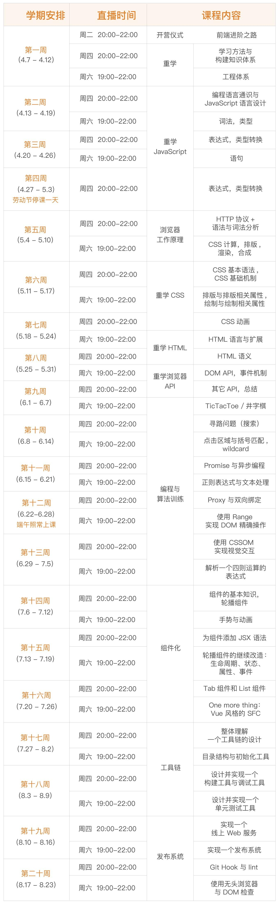

# FAQ

## 1、整体学习安排？

## 2、入学自评？

1. 编写一个 DOM 编辑器：可以自由地操作一个 iframe（空白）中的 DOM 结构，包括增、删、移动。
2. 讲讲 position float display 各有哪些取值，它们互相之间会如何影响？
3. JavaScript 启动后，内存中有多少个对象？如何用代码来获得这些信息？
4. HTML 的中，如何写一个值为 `“a”=‘b’` 的属性值？
5. 编写一个快速排序代码，并且用动画演示它的过程。

> 都不会……