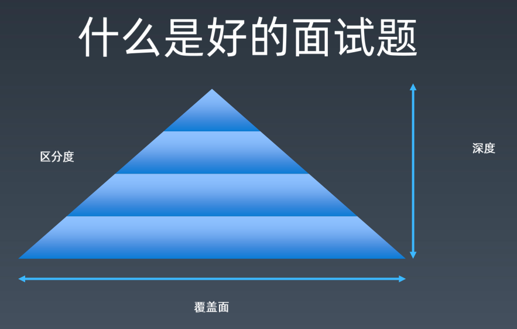
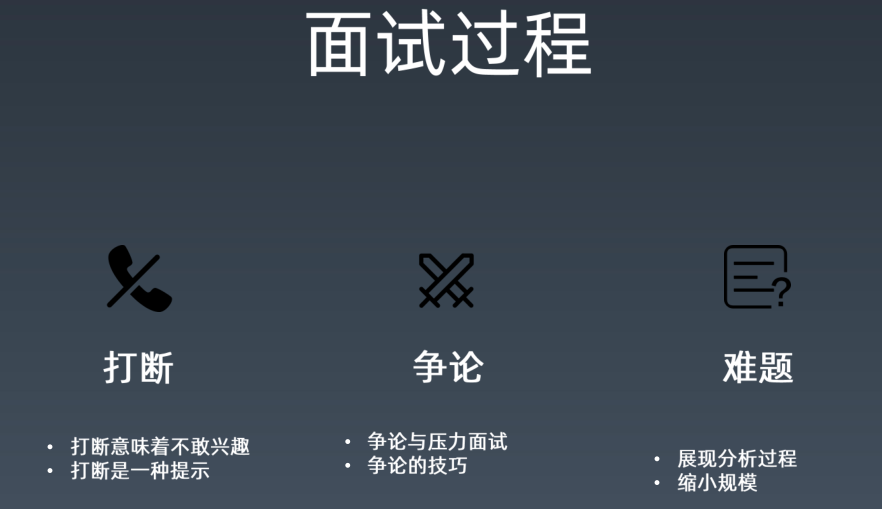
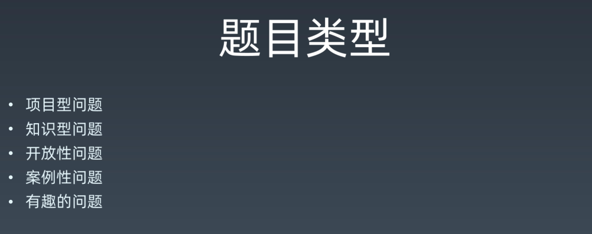

# 番外：面试官怎么想？

## 1、Q&A

### 1.1、整理法的实践中，是否包含对知识的追溯，而追溯的过程和结果是否也是整理的过程？

整理和追溯，winter认为这是建立知识体系的两个方法，而我们在建立知识体系的过程中，这俩方法都得要用，所以这二者肯定是要**结合起来用**的，不管是重学前端还是这次的前端进阶训练营里边所有的跟知识相关的东西，其实都是来自于这两个方法，没有第三个方法了 -> 这是winter学习前端的方法论

> 你中有我，我中有你

## 2、为啥要讲「面试官怎么想」呢？

其实是因为我们要去理解面试这件事情，winter觉得很多同学不理解面试这件事情，既然不理解，那么**你就不能很好地去面试了，甚至你没有很好地办法去学习** -> 所以「这必须得讲哈！」

> 我也不理解面试这件事……

## 3、什么是好的面试题？

一个好的面试题，winter认为有三要素，如果你平时承担面试任务的话，那么这三要素你可以好好研究一下

总之，这个话题既是给面试官听的，也是给我们听的……

好的面试题，有三要素：

- 区分度
- 覆盖面
- 深度

**1）区分度**

啥意思？

> 如果我问一个题，如某些算法题，如大草原算法题 -> 所有人都不会，再如「1+……+100的for循环」 -> 所有人都会 -> 而这种就不是好的面试题了。好的面试题要有区分度 ，好的人能答上来，不好的人能答上来，但这样还不够，要中等好的人，答得中等好，比较好的人，答得比较好，特别好的人，答得特别好，那么这个就叫做区分度了……

简单来说，这题有这样的能力，可以根据他人的回答的情况，可以区分出这些人的前端水平都是怎样的，不过，我个疑问，假如这人是因为背熟了面试题才回答那么好的呢？那该怎么区分呢？

**2）覆盖面**

什么叫覆盖面？

> 我一问这个题，都会激活你所有的前端知识，如「你想写一本前端的书，那么你的目录是什么样的？」 -> 这样就一下全覆盖到了 -> 这题难度特别高，不考虑区分度，大部分人答得都不好，在p6这个档次，winter还没有见过几个答得特别好的同学，但在网上答得还行，而这意味着这区分度不是特别好

**3）深度**

> 这题到底是从哪个难度到哪个难度，如有些题是为了简单区准备的，而有些题则是超高难度的，为高级的候选人准备的，所有这会有个深度范围的问题……

---

总之，以上这三个因素决定了一个面试题到底好不好

有些时候，你去一些比较差的公司，就会遇到这种不太好的面试官，如他们从网上搜题 -> 网上火的面试题，winter从来不用 -> 因为这些题**以「偏难怪」为荣**，还有一些同学因为自己没有面过试也没有参加实际的招聘工作，就会想出一些特别特比难的面试题，有些winter也答不上来……再如网上有些题把Promise、await、setTimeout等混得特别的乱，这种题就很难搞了，虽然细心一点就可以搞出来了，但这种问题问出来区分度是很差的……因为大家很难答对你这个问题……

当然，有些面试官特别有经验，他们可以从一些区分度低的问题里边，通过**追问、提示**等这些方法，即通过**面试官个人能力的补充**，把差的问题变成好的问题……

如winter有一个同事，总是问一些特别可怕的问题，特别边边角角的问题，有一次winter与这同事一同面试一位候选人，而这同事就问了一个特比可怕的问题，这一问，winter就着急了……但是之后没想到，这同事慢慢地通过一步步的提示、追问，最后都能让这个候选人答上来，至此，面试官还是可以通过这道题来**考察到候选人的水平**……但每次都把候选人吓得不行……

这同事在知乎live上大致分享过这样一个意思 -> 精华不在面试题本身，毕竟这面试题本身真得贼鸡儿差，但是通过自己的一步步分解，可以让候选人**有思路有启发** -> 而这就是所谓的**不同面试官有不同风格**……

说了那么多，winter其实想告诉大家：

- 大家不要特别纠结，有的时候你去面试一个公司，面完了，很痛苦，一直在想「为啥这题我就不会呢？一点都答不上来呢？」 -> 但其实问题不大，多面几家公司就好了，当然，如果你面10家，全都答不上来，那才说明自己有问题了 -> 总之，**多面几家心里就舒服了**……

➹：[大草原面试题到底是什么？ - 知乎](https://www.zhihu.com/question/28002693)

➹：[algorithm - Minimum number of circles with radius r to cover n points - Stack Overflow](https://stackoverflow.com/questions/15882202/minimum-number-of-circles-with-radius-r-to-cover-n-points)

## 4、面试过程中，经常会发生的那几件事？

> 1:17:42

**1）打断**

很多同学在面试的时候，滔滔不绝的balabala……突然，面试官打断了你……此时，你会紧张到爆表…… -> 怀疑自己讲错了，这次面试搞砸了……

但其实并不是这样，打断有的时候反而是**面试官非常nice的一种体现**，为啥这样说呢？

面试官「打断」这种行为意味着：

- 不感兴趣 -> 为啥打断？ -> 因为你讲的**离题**了 -> 如果不打断，那么这面试官应该就是不想要你了，如winter明知你讲错了，还不打断你，一直等你讲完，讲完后，直接来一句「面试结束」，可见，这表示不要你了，放弃你了，不然，就打断你，然后想一些问题问你……可见，面试官打断你，反而是件好事，因此你也无须紧张，直接面对他接下来的疑问就好了……总之，**打断意味着面试官认为你还有救，还想问你**，当然，如果面试官对这个人很感兴趣，但ta逼逼了半天，面试官不想继续听下去了，你不能因为对其感兴趣就不打断ta，你还是得打断ta，然后赶紧问一个能把ta拉回来的问题或者是借着「打断」再把话题插过来
- 所以打断有的时候是一种「提示」 -> 你以为是不好的？其实反而是一种**正面信息**，当然，**如果面试官直接打断，然后面试结束，这「打断」就不是特别好了**……

> 打断了 -> 你就停下来听面试官讲，当然，如果面试官不讲，那就say goodbye，否则，你就冷静下来听ta讲……

**2）争论**

这东西，与前边所提到内容特别的有关系……

很多人在面试的时候，都会遇到「争论」这种情况 -> 这在面试中是**特别需要去处理的问题**……

当然，如果像winter这种「老奸巨猾」的面试官，基本不会跟别人争论，如果这面试者讲错了，就默默地记住「这个人不行」，然后尽快结束面试……

争论，在平时有几种不同的情况（有3种不同的情况，这下边提到常见的俩种情况）：

**情况一：**

面试官其实并不想跟你争论 -> 但跟你争论其实这是他面试的**一种设计** -> 压力面试出现的比较多，不过，压力面试更多是出现在管理岗，如果你求职前端基本不会遇到 -> 不过现在套路用得多了，这压力面试不太好用了……即**故意要跟你争论**，来试一试你在这个事情上所理解的程度以及你对人、工作中遇到类似的问题你该怎么处理 -> 这种争论过程的本身，其实是处于面试官的控制之下的，而这种时候其实就是你表现的一个过程，如果你用了非常情绪化的方式去处理的话，不管你说得是正确还是错误都会给面试官留下不好的印象，甚至会给你记到面试表现里边…… -> **话说，阿里 P10 赵海平对王垠的面试是一种故意争论吗？压力面试？**

**情况二：**

面试官不成熟 -> 你不应该与他去争论 -> 面试官不成熟细分两种情况

1. 你是对的，他是错的
2. 你是错的，他是对的

联系一下前边所提到的**追溯法** -> **想争论赢，也是有技巧的**，不是说，这个人敢跟你争论，就表示他对这个问题非常有自信，然后你就怀疑自己难道真得是错的吗？然后就认怂？

小时候，我们学过如何写议论文，而议论文三要素是：

- 论点
- 论据
- 论证

> 论点就是你的**观点**
> 
> 论据就是你**证明自己观点的证据**，一般以事实或数据比较有说服力
> 
> 论证就是你**运用论据证明论点的过程**，注意，是一个论证过程，而不是文章的一部分

如果我们只跟面试官说「论点」 -> 那肯定会吵架了

如果你想**赢得争论**，你得这样来：

1. 一定要**克制自己的情绪**，在整个过程中既坚持又礼貌
2. 你要使用正确的议论文写法，**你的观点不是最重要的，论据和论证才是最重要的**，所以这个时候如果我们常用这「**追溯法**」，那就牛逼了呀！比如xxx面试官跟你辩论「闭包」，xxx面试官说「你记混了吧，我觉得闭包就是prototype，每一个对象上都有一个闭包」，此时，你咋办呢？ -> 使用追溯法 -> 你就说「1964年，闭包这个概念第一次在某杂志上提出，有个叫PJ Landin的人，在表达式自动执行这篇论文里边第一次提到闭包这个概念，其中，它是这样定义的，首先它有一个环境，还有一个变量列表、一个表达式，而这个表达式就是我们所谓的函数，所以我觉得在JS里边，函数才是闭包，JS的函数它其实是带着一个执行的environment，它是有这个属性的，而这个在JS 的标准里边也讲了函数有这么一个environment属性（旧版本这个属性叫scoped，而且是私有属性，有两个中括号`[[]]`括起来） 」 -> 你这样一讲，这个xxx面试官还敢反驳你吗？ -> 所以，在「争论」时，你得注意技巧哈！即使你记不了那么清楚（如我记不清是1964年，那么你可以说上世纪60年代……），你也尽量把这种来**源信息**给带出来，如「我记得他写的观点是这样的……然后把自己的观点藏到这人观点的后边，这样就显得**谦和和有理**了，这样面试官本来想说的下一句都不好意思说出来了」 -> 「有一次我在腾讯课堂听某个机构的老师在讲闭包的课，我回复了自己对闭包的理解（参照郭家宝在Node.js 开发指南一书里边所提到的闭包），而这种理解自认为对得上函数的执行行为，但老师表示并不是这样的……我也不好反驳，因为他已经教了好几年的课了，当然，我也没有认同他所说的……」

> 搞不清楚的问题，如作用域、执行上下文、闭包等，都可以去追溯一下，如它们都是从哪儿来的，如执行上下文这个概念当初在T39是怎么讨论的？现在**整个JS标准、issue、邮件啥的都是公开的** ，这样你就有机会去了解一下它们都是怎么诞生出来的……

总之，**不要跟面试官做一些无味的争论**，如「我是对的，面试官你是错的，两个人就像是**小孩子吵架**一样……」 -> 一定要知道**怎么去解决矛盾，怎么去聊天**……这样你才会给面试官留下一个**好的印象**，才会觉得你比较专业，即是自己说的还是错了，但面试官还是乐意面试者可以提供一些资料来佐证自己的，即便面试者还是说错了，面试官也会留下好的影响，说不定还会因为这个给面试者通过了……

> 不服他所说的，那就争论吧！ -> 情绪稳定+追溯法（论据）+论证 

**3）难题**

凡是难题其实对每个人来说都是不一样的，**有些题设计出来它就是一个难题，它可不是一个你可以立刻就能答出来的问题**

所以，对于这种本身问出来就已经让你**感到压力**的问题，其实是有一些处理的方法的：

1. **展现分析的过程** -> 7、8年前的winter遇到一个有关字符串模式匹配的问题——**Wildcard Matching**，该题很难，真实答案是用到了贪心算法，但是这贪心算法，**正常人**怎么可能一下子就能想得出来？于是，当时，winter听到这问题，就在10s内给了个「递归解」，而这时面试官说「不行呀，你再想想……」，于是winter就跟面试官一边聊，一边分析这个过程，winter大概花了一个半小时才分析出来这个题有「贪心解」，然后写代码又花了半个小时，整个面试大概聊了3个多小时，winter都聊吐了，完全无法理解这面试官为啥要给自己搞个怎么难的题 -> 当然，面试官既然出了这样问题，他肯定知道这不是一个可以在20分钟之内能够解决的问题 -> 总之，**展现分析过程，你不一定一次就给到最好的答案，你可以给一个次优解，你也可以给一个中间的步骤，但是你不能沉默**，一旦你沉默了，那么面试官就急了「你这人干什么的啊？你到底会不会呀？你是不是在拖延时间发愣啊！」
2. **缩小规模** -> 这是另外一个应对难题的技巧 -> 比如说有些题一上来就让你搞几千几万啥的，然后让你用代码解决，如一个经典的算法题「凑一块钱的硬币」 -> 这是一个动态规划的题，当然不用动态规划也能写 -> 一般做这个题比较好的姿势是：**不要沉默，虽然你在想，但面试官并不知道你在想**，接着，我们把问题缩小，如凑10块钱有多少种凑法？这个时候你就**把一个只能用计算机解决的问题，变成了一个人可以去分析的问题**，而这个时候，你在分析的过程中，你会获得很多信息，可能会找到很多的灵感，然后你就有机会拿到一个完美的解了，如果你最后不能得到一个完美的解，这也咩有关系哈！就像**不能交白卷**一样，毕竟在解决这个问题的过程中，你展现了很多你分析的思路，也有很多面试官会因为这个给你一些同情分

> 没想到缩小规模，也是可以把数字变大呀！难道是1毛即 0.1 这样不好算？

以上就是有关面试过程的内容了

---

更多：

线索 -> 「压力面试」「议论文」「如何争论」「如何聊天」「Wildcard Matching」

➹：[议论文三要素详解：论点、论据、论证_文易搜](https://www.wenyiso.com/sanyaosu/66.htm)

➹：[论文有三要素：论点、论据和论证 - 知乎](https://zhuanlan.zhihu.com/p/71491478)

➹：[压力面试怎么应对？ - 知乎](https://www.zhihu.com/question/19714075)

➹：[如何争论才能让人觉得很舒服？ - 简书](https://www.jianshu.com/p/ba88bd2f14ce)

➹：[如何在争论时有话说，并且优雅的争论？ - 知乎](https://www.zhihu.com/question/22815588)

➹：[如何评价阿里 P10 赵海平对王垠的面试？ - 知乎](https://www.zhihu.com/question/360622233)

➹：[如何变得会聊天？ - 知乎](https://www.zhihu.com/question/22867272)

➹：[[LeetCode]Wildcard Matching 通配符匹配（贪心）_Python_ckl_soft的专栏-CSDN博客](https://blog.csdn.net/cklsoft/article/details/40949747)

➹：[Leetcode 44. Wildcard Matching - 知乎](https://zhuanlan.zhihu.com/p/66969068)

➹：[Wildcard Matching · 算法珠玑](https://soulmachine.gitbooks.io/algorithm-essentials/java/string/wildcard-matching.html)

## 5、题目类型？

> 1:31:58

**1）项目型问题**

我们一般会把项目型问题作为整个面试的第一部分，即问一问你这项目是什么，做过啥东西等等，总之，主要是想让你讲一讲**你做过什么东西**

**2）知识型问题**

根据项目型问题，你说你是做数据库的，那么面试考你「红黑树」就没毛病了，同样，如果你是做前端，那就很有可能不考你「红黑树」了，而是考考你DOM的知识，CSS垂直居中等知识

当然，这是好的面试官才会这样搞，而不好的面试官就不可控了 -> **对抗不好的面试官，我们是通过大量的面试来解决的**……

**3）开放性问题**

**你答什么都不算错，但是这种问题也是最容易丢分的**，如「让你去设计一个什么东西，如机制、产品啥的」，看你有咩有这个产品sense……这样类似的问题的就是「开放性问题」了

关于这些问题的回答，人人都能说几句，但是你说要答好，有时候就很看你的**基础素质和反应能力**了

**4）案例性问题**

**这种问题是最多的**，一般winter也会把编程题放到案例性问题来 -> 给你模拟一个场景

之前提到「争论」，你说我们是否需要跟面试官争论关于是否要手写二叉树呢？

其实这种不属于争论，而是**跟面试官争论面试合不合理** -> 这不属于正常的面试争论

一旦出现这种争论，基本就可以告别面试了，毕竟面试官怎么面试不需要你来教，即是面试官错了，你也教不会他，所以你永远都不要跟面试官争论「你出的这个题应不应该会的问题」，说白了，这面试题会与不会对我们所干的活有影响吗？你这面试官有毛病吧？是不是想搞我？

如果你对这份工作存有任意一点想要拿下这份工作的想法，那么这种情况是严格杜绝出现的

案例性问题，它**不一定是实际的案例性问题**，即这个案例可能在现实中不会被发生，但是面试官可以透过这个案例去看你解决问题的能力，总之，大家不要认为案例性问题它就一定是适用于工作的，，如前端其实也不需要写排序，但有时候winter也会让面试者写排序，为啥呢？ -> 其实就是想看看面试者写的代码是咋样的呗！排序这种代码不算难，但稍微有点绕的代码他是否能写出来呢？ -> winter看的是他的**思维以及解决问题的能力**，而不是说「用sort不香吗？」

总之，**不要挑战面试官出的题，尽量尽自己最大的能力去做就好了……**

当然，如果这公司你是真得不想来，那么你可以讽刺几句面试官、吵几句，不过，这是不建议的行为，因为在这屋子里边，你们是应聘者和面试官，但出了这扇门就是陌生人了，早点回家不好吗？打两把和平精英不香吗？多看几个学习视频不妙吗？陪陪老婆孩子不好吗？……没有必要跟面试官在这里浪费时间哈！你们俩这辈子可能**没有第二次交集**了，最好别有……

总之，直接离开，反正你没有一点想在这个公司工作的念头……

**5）有趣的问题**

微软有个著名的问题「下水井盖为啥是圆的？」

为啥是圆的？ -> 圆的不会掉下去？其实下水井盖不全是圆的，掉不下去的形状还有很多，如勒洛三角形啥的……

面试官其实并不一定想听你说「圆的不会掉下去」这样的答案

通常，面试官问你这样的问题，潜台词是「恭喜你，**面试通过**了……」

面试官对你本身的基础素质还有更高的期望，总之，有趣的问题是一个特别好的信号 -> 面试官已经在跟你玩了，说明面试官的心情也比较放松，你想面试官为哈会开心呢？这可不是你面挂了感到开心，举例来说：

校招 -> winter之前一天面试20个人，但假如一个都不过，你说winter能开心起来吗？都快崩溃了，饭也吃不上了…… -> 所以，面试肯给你出有趣的问题，说明他心情不错……基本上，你已经十拿九稳通过面试了……

---

More：

线索 -> 「啥行为可定义为不好的面试官」「产品sense」「下水井盖」「基本素质」

➹：[面试的时候你最鄙视什么样的面试官？ - 知乎](https://www.zhihu.com/question/19649944)

➹：[什么是产品sense？ - 知乎](https://www.zhihu.com/question/30850582)

➹：[怎样定义产品人员对产品的 sense？产品新人又该如何培养对产品的 “sense”？ - 知乎](https://www.zhihu.com/question/19831995)

➹：[如何拥有产品sense？ - 人人都是产品经理](http://www.woshipm.com/pmd/41360.html)

➹：[下水井盖为什么是圆的？ - 知乎](https://www.zhihu.com/question/27086617)

➹：[井盖为什么是圆的？ - 知乎](https://www.zhihu.com/question/19678960)

➹：[井盖为何是圆的？加了鱼的水有多重？微软奇葩面试题究竟在考什么](https://www.iyong.com/displaynews.html?id=2936314676839296)

➹：[什么是素质（素养）？ - 知乎](https://www.zhihu.com/question/21763509)

➹：[你认为员工必备的基本素质与能力有那些？ - 知乎](https://www.zhihu.com/question/65032517)

➹：[说，经济基础决定个人素质高低的论点对么？ - 知乎](https://www.zhihu.com/question/46551259)

➹：[学习计算机相关专业，需要具备什么样的基本素质？ - 知乎](https://www.zhihu.com/question/29104356)

## 6、面试官如何评判？

为啥winter**一定**要讲这个呢？

因为这个问题很多时候**影响着大家学习的方式**，面试官评判一个人，他可能会因为一个问题，整个就不通过了，同样，他也可能因为一个问题，直接就把这个人给招了，总之，这并不是一个最后算总分的问题

有的同学特别纠结「这个面试题不会，那个面试题不会」 -> 因为这样，所以大家才会去学一堆垃圾知识，然后堆在一个小屋子里边，就如之前所提到的「知识体系的建立」

winter认为：

面试其实是一个展示你自己的过程，只要展示到位了，这面试也就是结束了 -> 回顾今晚这个主题「为啥要让大家去建立知识体系」，当你建立了一个知识体系，面试官不管问什么样的问题，你都可以从知识体系的角度去回答，而**从知识体系的角度去回答，那么就有很高的机会去赢得面试官的认可**，像阿里这样比较好的企业，其面试会有非常规范的流程，它会有很大概率只要看到你有知识体系，就直接会把你给招进来，所以说，这个问题不管你会还是不会，这都不是重点，你只要能够清楚的定位到这个问题，放进你的知识体系里，那么winter就觉得你已经**立于不败之地**了，除非你遇到一些非常差的面试官，当然，那也不是你的问题，面试本来就是两方面的事情

这就是为啥winter特别想跟大家分享知识体系的原因所在了

如何建立知识体系？ -> 有整理和追溯这两方法，把你的知识整理到一张大的脑图上，然后能够把一些细的点做一些追溯，那么你的知识体系就已经建立起来了，未来你发现这知识体系哪个不太对，那就小修小改呗，而这已经是下一步的事儿了，总之先把建立知识体系这第一步给搞起来，再考虑下一步如何完善这个体系的问题

**凡是跟知识相关的课程，其实都是在帮助大家去建立知识体系，而不是去教大家一个个具体的知识**，如winter给大家讲了一遍0.1+0.2=0.3这个事情，到你面试的时候，面试官问到了这题，你该答不上来，还是答不上来，所以winter并不是在解答0.1+0.2=0.3这个问题，而是这个浮点数它到底是怎么一回事儿，除了浮点以外，JS里边还有多少个类型，winter会从这个角度去给大家讲前端知识，如7种类型，浮点型遵循xxx标准，有指数部分和数值部分，你把这样类似的东西给记住了，你说「你把0.1+0.2是否等于0.3」能不能记住又有啥关系呢？

> 不要记住答案或者说这个知识的这么一个结果，而是去理解这个答案或者这个知识背后的逻辑……

---

More：

线索 -> 「面试官 评判」

➹：[作为面试官你通常都是怎么写评语的？ - 知乎](https://www.zhihu.com/question/264859259)

➹：[作为面试官，你一般会从哪些方面考核一个面试者？ - 知乎](https://www.zhihu.com/question/19629134)

---

这节课：

- 分享学习方法
- 课程设计思路，帮助大家了解后边的课程是以一种什么样的形式去学习

winter希望这次训练营结束后，大家都能有一个自己建立好的知识体系，以及大家都能够在一些知识点上有一些自主的追溯，还有对一些细节的点能够有自己独到、独门的理解，甚至是超过winter对其的理解……

## 7、学到了什么？

- 通过整理法+追溯法 -> 建立起自己的知识体系

