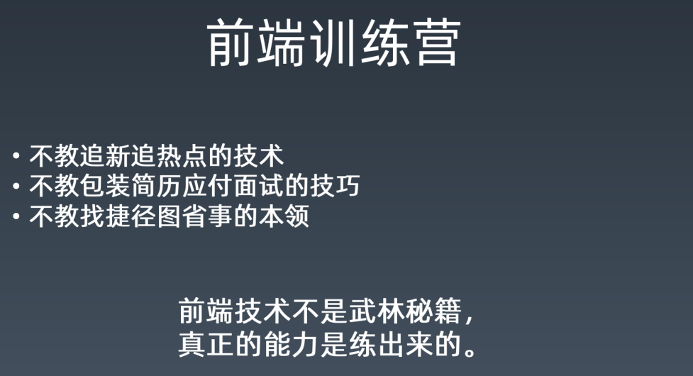
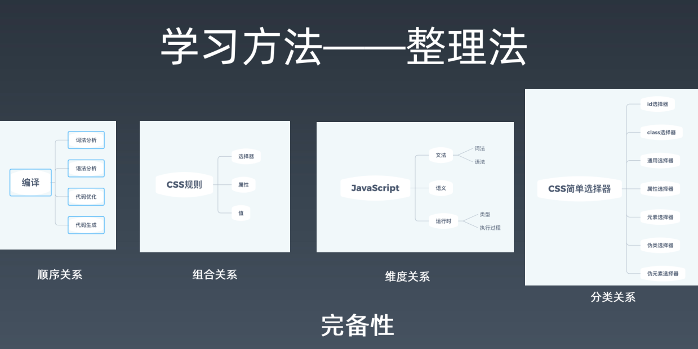

# 01-重学-学习方法

> 不把学习方法讲清楚，那么你学的这个知识点其实是没有意义的！

## 1、关于前端，你都会什么？

> 如果你要写一本关于前端的书，那么这本书的目录你会写些啥？

问这个问题的潜台词是「你的知识是否成体系？」 -> 想想你面前有个小房子，里边装的都是乱七八糟的知识，你也不知道哪个重要，哪个不重要，反正就是堆在里边吃灰，人家问你「你会啥？」 -> 你一打开这个房子的门，直接地就拎出了一个你每天都会用到的知识出来，如「我会CV」「我会……」 -> 不用的知识会发霉，会烂掉，那么你当初花时间学得这些「知识」其本质其实就是「垃圾」 -> 一看就会一用就废 -> 为啥？ -> 因为你没有整理知识

**如果你没有知识体系，那么你学再多的东西，都是往垃圾堆上堆东西** 

总之，**学前端必须要有知识体系**

> 知识体系？ -> 张三有他自己一套的前端知识体系 -> 李四也有他自己的一套 -> 王五也有 -> 哪套好？ -> 适合自己才是最好的？ -> 何为「适合自己」的？ -> 先找一套自认为非常好的，比如winter老师的，然后不断改成适合自己的（可货比三家）

➹：[构建一个知识体系时，有哪些高效的技巧？ - 知乎](https://www.zhihu.com/question/27901512)

➹：[如何建立自己的认知体系？ - 知乎](https://www.zhihu.com/question/19591121?rf=20159235)

➹：[★《如何高效学习》这本书到底在告诉我们什么秘诀！ - 知乎](https://zhuanlan.zhihu.com/p/127046269)

## 2、关于前端，你都不会什么？

## 3、你会针线活吗？

会简单的针线活 -> 如衣服哪里破了一个洞，就会用针线补起来……

那么问题来了「关于前端，你会什么？」，你为啥不回答「我会针线活」呢？

> 因为你问的是「关于前端呀！」，针线活跟前端没关系吧！就像我会吃饭，可这跟前端有半毛钱关系吗？

这也是一个关于体系化的思考 -> 因为你要考虑一个东西是否在一个东西的范围内？如针线活是在前端的范围内吗？如果不是，那么你会不会针线活，对你学习前端，咩有半毛钱的影响……

有些时候，你会遇到一些奇葩的面试官，问你会不会「hadoop」等这样与前端无关的东西，而这就像是在问你「你会针线活」吗？

> 搞清楚前端边界它的整个模型（描述）是啥？

➹：[人类的认知是否存在理论上的知识边界(认知终点)？ - 知乎](https://www.zhihu.com/question/41193259)

➹：[人类乃至整个宇宙的知识、理论会有终点吗？ - 知乎](https://www.zhihu.com/question/23963850)

➹：[科技的终点是什么？ - 知乎](https://www.zhihu.com/question/361211435)

## 4、前端技能模型？

> 先尝试自己整个你所认为的模型出来，然后再看winter老师的

分析这张图：

最底下有三大能力：

- 编程能力
- 架构能力
- 工程能力

所谓的编程能力 -> 给你一个题目能不能写出来，如面试常见的算法题、异步编程等等都在编程能力的范畴（范围）之内

总之，**我们能否把一个复杂的逻辑理清楚，分拆出来，最后实现，那么这个能力就是所谓的「编程能力」**

编程能力是所有计算机岗位里边的基础能力 -> 不会编程，那就不要进来，不管是运维还是现在做的自动化测试都需要编程能力

> 编程能力是很关键的基础能力

架构能力？ -> 与编程能力有之一些模糊不清的分界

区别：

- 编程能力 -> 解决难、写不出来的问题
- 架构能力 -> 解决大、写不出来的问题

简单来说，一个系统，其实你每个点，你都能实现，每个功能，你都能实现，但是整个系统，你就不一定能实现了

注意，这可不是你一个个写出来，然后组装起来，然后这个「系统」就可以正常工作了

架构能力，它可是包含了你对一个复杂系统进行**分析**、对这个复杂系统所需要的程序进行**软件设计**以及你对里边的一些代码，多个程序员之间的协同去进行**管理**这样一些不同的方面，而这就是所谓的「架构能力」

如果说编程能力是解决**难**的问题，架构能力是解决**大**的问题，那么工程能力就是用来解决**人**的问题，即人多该如何去协作的问题

如果你把所有的代码都让一个架构师来写的话，理论上，他也应该都能写出来，但是，通常我们软件工程，都不是让一个特别牛逼的程序员来solo写完的

那么这个时候，就需要有人有工程能力了，如你可以把这些程序员给组织起来，这个「组织」在「软件工程」这个概念咩有很好提出之前，其实是一群纯管理者在试图解决这个问题，他们往往采用老的那一套「抽象人力管理方式」，如统计大家盯着屏幕的时间、数代码行数、统计bug数…… -> 这些东西都是外行去管理内行的做法，不要觉得这种管理姿势离你很远，日本现在有很多软件行业，还是在这样管理的…… -> 这种管理姿势就叫做「工程能力不行」

工程能力不行 -> 软件的质量不可能好 -> 你的编程能力、架构能力再好，也架不住所谓的「一颗老鼠屎坏了一锅粥」 -> 这会对前端造成毁灭性的打击

这三项能力对任何一个程序员分支来说，如前端、后端、图形游戏等，这些公司缺少这些能力，它都是毁灭性的打击……

而前端跟它们有些不同，主要在于前端它有领域知识，比如我们用的语言基本上是JavaScript，当然，你也可以是TypeScript，但这些都不重要，界面描述会用HTML，样式会用CSS，另外还有很多浏览器API知识……

你知道你让一个服务端程序员来写前端，他们感到最痛苦的是什么吗？

> 是写CSS哈！浏览器API他们用一用也是可以的，JS 虽然有些痛苦，但写一写还是不成问题的！

他们为啥对CSS感到最痛苦呢？

> 因为CSS离他们的领域知识最远，另外他们特别讨厌还原设计稿这件事

所以说，前端的领域知识不全是技术类的，还有切图又快又好、如何精确还原设计稿等，都是前端的核心竞争力

> 上边这个领域指的是程序员因分支而形成的领域，下边这个则是在一个领域里边，再去划分领域…… -> 领域（事物范围），如Java有个知识范围，前端也有一个

回到图中，最顶处有个「领域知识」，那么啥是「领域知识」呢？

举个栗子你就明白了

假如我是一个做电商的（现在叫新零售了，不叫电商了），做新零售的，除了技术本身，你还得了解很多新零售这个领域里边的知识

如winter老师刚来阿里时，不知道「埋点」为何意？……之后他才知道……

「埋点」全称叫「数据统计埋点」，简单来说，它是数据统计的一个步骤，如数据统计它有数据埋点、数据分析、数据展现等多个零碎碎的知识

如果winte老师不做这样相关的业务，那么他是基本不懂「埋点」是啥东东的……

winter在阿里工作5、6年以后，对这个事情有了一个非常深入的理解，如搞一些自动化埋点什么的

> 课程重点讲前端知识，不会讲类似「埋点」这样的领域知识，毕竟领域知识跟你所做的业务领域有关系，而这意味着并不是所有人都能用到，总之，课程是尽量帮助大家解决通用性问题的

题外话，了解领域知识最好的方式是，不是说去学习一个课程，毕竟这样的课程是很少的，如winter要开个数据分析的班，能有100人报名就谢天谢地，毕竟这样的课程不具有泛用性……

极客邦有个很好的产品解决了这个问题，那就是「**QCon**」啦！ -> 在「[Qcon](https://qcon.infoq.cn/2020/beijing)」里边你可以了解到的领域知识最多 -> 你可以从中挑一个你喜欢的专题，每年都会有很多这样的知识

> 通过winter的讲解，我们对前端的学习有了一个整体性的了解，虽然只是短短的十几分钟，但这些东西我从未见过有哪个培训机构能这样讲到过……基本上就是直接拿「前端知识」展开来讲 -> 这种做法表面上看你似乎可以学到很多东西，但其实你会发觉你一直都没有站在一个大局观去学习一个东西……讲严重点，就是在堆垃圾，而是不是在堆垃圾只需要听winter讲十几分钟就可以逆转过来了……虽然学的东西还是那些，但是看这些东西的眼光似乎有点不一样了……

既然，我们知道前端大概包含了这些东西，那我们该如何去提高呢？

补充：

对「工程能力」了解更多：

➹：[什么是「工程能力」？ - 知乎](https://www.zhihu.com/question/65779990)

➹：[如何评价王垠最新文章，《DRY原则的危害》? - 知乎](https://www.zhihu.com/question/31278077)

## 5、如何提高自己的前端水平？

编程能力、架构能力、工程能力 -> 通过「刻意练习」来提高

**如何提高「编程能力」？**

> 刷题

就拿红黑树来说，前端基本上用不到它，winter工作10多年，都咩有在工作中用到它，那么用不到它，是不是意味着就不用去学习它呢？ -> 显然不是，从不会到会，这个过程可以锻炼我们的编程能力

不要纠结：

- 学了就忘 -> 想只学一遍，就能一辈子不会忘记……做梦 -> 反正这只是一种练习而已，忘记了就忘记了
- 工作是否用得上 -> 工作用到了才去学，用不上就不学，反正就是要追求极大的性价比，能给我赚钱的，才去学 -> 可当你打算换个工作呢？你还有选择吗？

**如何提高「架构能力」？**

> 也是刻意练习，但不太好刻意练习，而「编程能力」找题刷就行了，winter老师建议「架构能力」的提高得去「读源代码，参与开源项目」

举栗来说：

手机淘宝 -> 在App Store里边基本算是复杂性最高的App之一了，但它的前端架构没有多复杂，你能从中学到的架构能力是很少的，但是它的工程方面是很复杂的……

架构能力的提高，平时基本上都是去看别人的项目，如Vue3.0

有很多人推荐去读源代码，认为这是一种**高级行为**，但winter并不推荐大家去通读源代码，winter建议这样去学习源代码：

- 看看该项目别人提的issue -> 实际参与一下别人的项目 -> 读部分的源代码 -> 带着「解决一个issue的目的」去读，而不是带着「通读源代码」的目的去读
- 试图去解决一个issue -> 项目跑起来 -> 解决项目这个bug -> 该过程提高最大

**如何提高「工程能力」？**

> 相较于「编程能力」和「架构能力」，该能力的提高贼难，只能通过一些选择更合适的工作，努力在公司里边争取，以此来实现对「工程能力」的提高……

我在知乎上看了一些回答，就是说「如何把一个产品高质量的完成」，你从0接触这个产品，到1完成这个产品的过程，就是在 pk 你的工程能力……

---

老师这个课程，就是提供了一个「刻意练习」的环境，从课程目录中可以看到，重点围绕着这三大能力来帮助大家提高……

## 6、关于教授知识和教授能力？

目前市场上，大多都是教授知识为主，winter老师这个课主要是教大家建立知识体系，而不是教前端知识，相当于帮你在杂乱的小房子里边放上置物架，教你怎么去分类，怎么去管理仓库……而不是再次往仓库里边塞知识，如「重学前端」专栏里边，每一章的最后都会有一个很有启发性的小问题，如「为啥0.1+0.2不等于0.3？」，如果我们把这些东西看做是单独的知识，那么这其实是辣鸡知识哈！但是，如果你把它看做**一种帮助你建立完善知识体系的线索**的话，那么该专栏里边的每一章的每一个小问题，它都是非常非常有价值的……

这些小问题都是winter老师精挑细选出来的，而且是非常细节的小问题，如果你的知识体系能够去解决这些问题的话，那么这意味着你的知识体系已经非常强壮了！

而这也是为啥要叫「重学」的原因！

> 回炉重造

补充：

线索的意思：

> 阅读题中的词语最好是借助具体的语境来分析。
>
> 线索一般是指解决某个问题或完成某项事情的依据或方向标、路线图。

也就是说，winter在重学前端专栏里边每一章所留下的小问题都是在帮助我们完善自己的知识体系咯！ -> 小问题即是「线索」，一种方向标 -> 如果咩有这些小问题，那么你是不知道该如何去完善自己的知识体系……就像是你明明应该走这条性价比最高的路，但是你却走了一条性价比极低的路……

➹：[线索是什么意思_百度知道](https://zhidao.baidu.com/question/74488023.html)

## 7、关于「领域知识」的学习？

建议大家在实践中学习 -> 根据自己所处的行业以及自己的职业规划，找到机会去学习……

---

以上就是关于前端整个的整体部分介绍了……

## 8、关于「前端训练营」？

**第一点：**

关于最新技术的学习 -> 通过这次训练营，如果你能把三大能力以及前端知识提高上来，那么学习这些新东西都是顺理成章就懂了……

> Vue教得再好，你还不如去看文档，Vue官方教程写得很好，既然Vue自己有教程形的文档，为啥你还要到其它机构里边去学一遍Vue呢？

winter教的东西是平时不太好找到的东西，前端知识都有，但是教你知识体系、教你能力的机构是很少的……

**第二点：**

通过这次训练营 -> 你是真正提高了 -> 面试一个合适的岗位 -> 自己能有阿里P6层级的资深工程师水准 -> 不是靠欺骗得来，不然对企业不负责任，对社会也不负责任…… -> 所以不要包装简历

训练营里边的模拟项目，建议不要写进自己的简历里边，而是希望你能通过课程里边所教的模拟项目，学习到本质的知识，然后应用到真正公司里边所开发的东西里边去 -> 再把这东西写到简历里边去 -> 该过程特别的长！

不建议像其它机构那样，做一个东西，然后截个图就放到简历里边去，然后把这东西当成是自己的作品

**第三点：**

此次训练营 -> 教的都是非常让人感到痛苦的事儿 -> 整个学习过程没有特别多省事的途径

学习本身就是痛苦的 -> 极客时间卖的就是帮助你应付这种痛苦的服务 -> 如果你能找到啥产品，可以让你像打「和平精英」吃鸡一样快乐的话，那么我想这样的课程肯定是有问题的……

讲真，没有人愿意为痛苦付钱，但是还是有人想往这个方向尝试做一些产品出来…… -> 对于学习者而言，只能说句「我忒难了，花钱买难受，就像到健身俱乐部里边花钱买个会员然后再里边锻炼身体一样」

**第四点：**

不是说你报了这次训练营，就可以像张无忌那样掉下断崖捡到金手指，如九阳神功，然后就可以吊打天下了，马上变成一线高手了 -> 真正的能力是靠练出来的

大家学完这个训练营的课程，能有多大的提高，不取决于老师怎么做，而是取决于「你怎么做」 -> 你投入的时间越多，效果越明显 -> 总之「要努力」哈！

班主任、助教机制 -> 比你孤独的努力更有意思 -> 而且有团体的小组织，如「刷题小组」 -> 添彩头-> 刷题不够，发红包 -> 变成红包群 -> 刷题不够，做分享 -> 不分享就踢出 -> 还有同城线下交友，聚一聚 -> 找到一些伙伴，相互督促学习前端知识……

## 9、学习方法——整理法？

> 33:26

这个整理法就是所谓的「**架子**」 -> 想想一堆用于拼图的扁平零片，如果你不整理成一块完整图案，那么你这些扁平零片一点意义的都咩有，即知识碎片一点意义都咩有……

整理法有**四种关系** -> 我们去整理知识的时候，其实是在知识之间建立一些关系

当你把所有的知识，全都通过这个**关系**串联起来之后，有些东西就是你想忘掉都忘不掉……因为你能够记住它相关的知识，而且在面试的时候，即使你遇到了这个点不会，你也可以迅速地定位到它是哪个领域的知识，它跟什么东西特别特别相关，然后你就可以马上说出一些即是没有能够回答问题也可以让面试官非常满意的一些内容……

那么有哪些关系呢？

举几个栗子来说：

**第一种：顺序关系**

特点是 -> 每一个子节点都是父节点它的一个**步骤** -> 具有明显的先后关系，即顺序不能乱

当子节点这每一个步骤都做完了，最后它们会组合而成父节点

如我们想学「编译」这个知识该怎么学呢？

我们要学四样东西 -> 编译的四个步骤

1. 词法分析 -> 它是干什么的？ -> 把源代码给分成一个个有意义的词
2. 语法分析 -> 把一个个的通过词法分析产出来的「词」，把它变成一颗「抽象语法树」（AST） -> 其实是先建语法树，再建抽象语法树
3. 代码优化 -> 根据这颗AST，对其代码结构进行一些优化 -> 其实这不叫代码优化，而是基于AST的一些优化 -> 客观上，你写出了一些性能不太好的代码，但是它给你做了很多比较好的代码 -> 最后会给你做代码生成
4. 代码生成 -> 根据AST生成代码

以上这些知识本身对于大家来说并不重要，我只是想告诉大家「**我们对有一些知识是把它分解成一种顺序关系**」

**第二种：组合关系**

如何学习 CSS rule？

把 CSS Rule 分成三个部分：

- 选择器部分 -> 包含常见的`*`、`#`、`~`、`>`等各种各样的选择器 -> 而这些选择器都是你要去学习的
- 属性部分 -> 大括号里边的键值对 -> 我们要学一些属性，但它们是干嘛用的呢？ -> `position`啥意思？`display`啥意思？`width`啥意思？……
- 值部分 -> 有带单位的值、函数型的值……

特点 -> **父节点它在描述一个事物，子节点在描述这个事物的各个部分** -> 总之，这是一种组合关系

**第三种：维度关系**

那JS来说，有这么一句古诗「横看成岭侧成峰，远近高低各不同」，你**从不同的角度看JS会有不同的感受**

你从「文法」的角度看JS -> 你要掌握它的「词法」和「语法」 -> 其实，词法和语法对于「文法」来说，它也是维度关系哈！毕竟，在你的JS代码里边，你写的每一个都是一个词，而且它也都在一个语法结构里边

那么所有的文法你都掌握了 -> 可这能证明你会JS 了吗？

显然，这是不是的，你还得知道**语义**

每一个语法结构 -> 它都有一个语义 -> 如`if`是啥意思？`function`是啥意思？……

最后还有一个「**运行时**」，这又是一个看待JS的角度 -> 你写的任何一段JS代码，它都有运行时的一些效果，**所谓的「运行时」就是我们最后想要的效果**

总之，我们学习JS可以通过这三个角度来搞！

**第四种：分类关系**

这种关系比较好理解，比如说「CSS简单选择器」

所谓的简单选择器就是不带复合关系，如父子啥的，就是直接选中哪一类元素

它可以分成「id选择器」、「class选择器」等

特点 -> **父类它是一个集合，每个子类是这个集合的子集**

---

**当你试图想要去建立一个知识体系的时候，我们不光要有「关系」，还得有「完备性」**

那么啥叫完备性呢？ -> **简单来说就是「恰好不多也不少」**

举个栗子 -> 编译原理

如果「编译」还有第五个步骤，那么我们对这个知识就是「完备性」出了问题

其实，编译原理还有一个「语义分析」步骤，当然，这是一个optional的步骤，即这是可选的……

毕竟有些语言它是不太需要语义分析的，对于简单的语言来说，尤其是脚本性的语言，它不需要语义分析

那哪些语言需要语义分析呢？

如C++ -> 你必须得做语义分析，它很特别，如果你不做语义分析的话，那么你连语法分析都做不了 -> 相较于其它需要做语义分析的语言来说，它更特别

---

总之，我们要特别注意的是，我们去总结知识，建立知识体系的时候的这种**完备性**，一旦这个中间发生了「**漏**」 -> 那么你的这个知识体系就有了「漏」，那么你将来整理知识的时候，就像你整理房间的时候，有些东西你不知道该放在哪个架子上，既然你不知道放在哪个架子上，那么这就说明你这个架子规划错了！ -> 有些东西虽然漏了，但这些东西并没有放进房间里边 -> 这不要紧，没啥大不了的 -> 但是**你把架子规划错了，那么这就是大事了**

以上就是winter老师所介绍的第一个学习方法——整理法

做这个「整理」有一个非常重要的工具 -> **脑图**

以下是对「整理法」这个学习方法的实际案例教学

> 我需要1小时整理老师所讲的9分钟内容 -> 老师讲90分钟，我得花10个小时…… -> 这效率未免也太低了吧

➹：[日本整理收纳流派大盘点！找到最适合自己的方法才最重要 - 知乎](https://zhuanlan.zhihu.com/p/24113053)

➹：[有哪些好用的整理与收纳经验？ - 知乎](https://www.zhihu.com/question/20967699)

➹：[如何有效地进行资料整理？ - 知乎](https://www.zhihu.com/question/21929143)

➹：[怎样整理知识体系，高效输出？ - 知乎](https://www.zhihu.com/question/379253515)

➹：[具儀式感的整理方法成為一種潮流，但人生是否只需要「怦然心動」就夠了？ - Szu Yu - Medium](https://medium.com/@sabrinamochi/%E5%85%B7%E5%84%80%E5%BC%8F%E6%84%9F%E7%9A%84%E6%95%B4%E7%90%86%E6%96%B9%E6%B3%95%E6%88%90%E7%82%BA%E4%B8%80%E7%A8%AE%E6%BD%AE%E6%B5%81-%E4%BD%86%E4%BA%BA%E7%94%9F%E6%98%AF%E5%90%A6%E5%8F%AA%E9%9C%80%E8%A6%81-%E6%80%A6%E7%84%B6%E5%BF%83%E5%8B%95-%E5%B0%B1%E5%A4%A0%E4%BA%86-891ec8bc4708)

➹：[你有什么值得分享的高效学习方法？ - 知乎](https://www.zhihu.com/question/50343728/answer/1050555188)

➹：[从KonMari的“怦然心动整理法”，看日美整理文化的差异 - Nippon.com](https://www.nippon.com/cn/guide-to-japan/g00669/)

## 10、整理法的案例教学？

> 42:00

