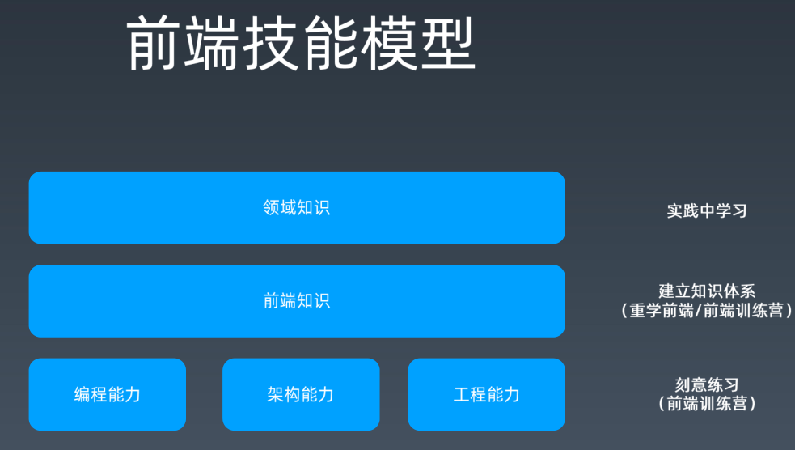

# 01-重学-学习方法

> 不把学习方法讲清楚，那么你学的这个知识点其实是没有意义的！

## 1、关于前端，你都会什么？

> 如果你要写一本关于前端的书，那么这本书的目录你会写些啥？

问这个问题的潜台词是「你的知识是否成体系？」 -> 想想你面前有个小房子，里边装的都是乱七八糟的知识，你也不知道哪个重要，哪个不重要，反正就是堆在里边吃灰，人家问你「你会啥？」 -> 你一打开这个房子的门，直接地就拎出了一个你每天都会用到的知识出来，如「我会CV」「我会……」 -> 不用的知识会发霉，会烂掉，那么你当初花时间学得这些「知识」其本质其实就是「垃圾」 -> 一看就会一用就废 -> 为啥？ -> 因为你没有整理知识

**如果你没有知识体系，那么你学再多的东西，都是往垃圾堆上堆东西** 

总之，**学前端必须要有知识体系**

> 知识体系？ -> 张三有他自己一套的前端知识体系 -> 李四也有他自己的一套 -> 王五也有 -> 哪套好？ -> 适合自己才是最好的？ -> 何为「适合自己」的？ -> 先找一套自认为非常好的，比如winter老师的，然后不断改成适合自己的（可货比三家）

➹：[构建一个知识体系时，有哪些高效的技巧？ - 知乎](https://www.zhihu.com/question/27901512)

➹：[如何建立自己的认知体系？ - 知乎](https://www.zhihu.com/question/19591121?rf=20159235)

➹：[★《如何高效学习》这本书到底在告诉我们什么秘诀！ - 知乎](https://zhuanlan.zhihu.com/p/127046269)

## 2、关于前端，你都不会什么？

## 3、你会针线活吗？

会简单的针线活 -> 如衣服哪里破了一个洞，就会用针线补起来……

那么问题来了「关于前端，你会什么？」，你为啥不回答「我会针线活」呢？

> 因为你问的是「关于前端呀！」，针线活跟前端没关系吧！就像我会吃饭，可这跟前端有半毛钱关系吗？

这也是一个关于体系化的思考 -> 因为你要考虑一个东西是否在一个东西的范围内？如针线活是在前端的范围内吗？如果不是，那么你会不会针线活，对你学习前端，咩有半毛钱的影响……

有些时候，你会遇到一些奇葩的面试官，问你会不会「hadoop」等这样与前端无关的东西，而这就像是在问你「你会针线活」吗？

> 搞清楚前端边界它的整个模型（描述）是啥？

➹：[人类的认知是否存在理论上的知识边界(认知终点)？ - 知乎](https://www.zhihu.com/question/41193259)

➹：[人类乃至整个宇宙的知识、理论会有终点吗？ - 知乎](https://www.zhihu.com/question/23963850)

➹：[科技的终点是什么？ - 知乎](https://www.zhihu.com/question/361211435)

## 4、前端技能模型？

> 先尝试自己整个你所认为的模型出来，然后再看winter老师的

分析这种图：

最底下有三大能力：

- 编程能力
- 架构能力
- 工程能力

所谓的编程能力 -> 给你一个题目能不能写出来，如面试常见的算法题、异步编程等等都在编程能力的范畴（范围）之内

总之，**我们能否把一个复杂的逻辑理清楚，分拆出来，最后实现，那么这个能力就是所谓的「编程能力」**

编程能力是所有计算机岗位里边的基础能力 -> 不会编程，那就不要进来，不管是运维还是现在做的自动化测试都需要编程能力

> 编程能力是很关键的基础能力

架构能力？ -> 与编程能力有之一些模糊不清的分解

区别：

- 编程能力 -> 解决难、写不出来的问题
- 架构能力 -> 解决大、写不出来的问题

简单来说，一个系统，其实你每个点，你都能实现，每个功能，你都能实现，但是整个系统，你就不一定能实现了

注意，这可不是你一个个写出来，然后组装起来，然后这个「系统」就可以正常工作了

架构能力，它可是包含了你对一个复杂系统进行**分析**、对这个复杂系统所需要的程序进行**软件设计**以及你对里边的一些代码，多个程序员之间的协同去进行**管理**这样一些不同的方面，而这就是所谓的「架构能力」

如果说编程能力是解决**难**的问题，架构能力是解决**大**的问题，那么工程能力就是用来解决**人**的问题，即人多该如何去协作的问题

如果你把所有的代码都让一个架构师来写的话，理论上，他也应该都能写出来，但是，通常我们软件工程，都不是让一个特别牛逼的程序员来solo写完的

那么这个时候，就需要有人有工程能力了，如你可以把这些程序员给组织起来，这个「组织」在「软件工程」这个概念咩有很好提出之前，其实是一群纯管理者在试图解决这个问题，他们往往采用老的那一套「抽象人力管理方式」，如统计大家盯着屏幕的时间、数代码行数、统计bug数…… -> 这些东西都是外行去管理内行的做法，不要觉得这种管理姿势离你很远，日本现在有很多软件行业，还是在这样管理的…… -> 这种管理姿势就叫做「工程能力不行」

工程能力不行 -> 软件的质量不可能好 -> 你的编程能力、架构能力再好，也架不住所谓的「一颗老鼠屎坏了一锅粥」 -> 这会对前端造成毁灭性的打击

这三项能力对任何一个程序员分支来说，如前端、后端、图形游戏等，这些公司缺少这些能力，它都是毁灭性的打击……

而前端跟它们有些不同，主要在于前端它有领域知识，比如我们用的语言基本上是JavaScript，当然，你也可以是TypeScript，但这些都不重要，界面描述会用HTML，样式会用CSS，另外还有很多浏览器API知识……

你知道你让一个服务端程序员来写前端，他们感到最痛苦的是什么吗？

> 是写CSS哈！浏览器API他们用一用也是可以的，JS 虽然有些痛苦，但写一写还是不成问题的！

他们为啥对CSS感到最痛苦呢？

> 因为CSS离他们的领域知识最远，另外他们特别讨厌还原设计稿这件事

所以说，前端的领域知识不全是技术类的，还有切图又快又好、如何精确还原设计稿等，都是前端的核心竞争力

回到图中，最顶处有个「领域知识」，那么啥是「领域知识」呢？

举个栗子你就明白了

假如我是一个做电商的（现在叫新零售了，不叫电商了），做新零售的，除了技术本身，你还得了解很多新零售这个领域里边的知识

如winter老师刚来阿里时，不知道「埋点」为何意？……之后他才知道……

「埋点」全称叫「数据统计埋点」，简单来说，它是数据统计的一个步骤，如数据统计它有数据埋点、数据分析、数据展现等多个零碎碎的知识

如果winte老师不做这样相关的业务，那么他是基本不懂「埋点」是啥东东的……

winter在阿里工作5、6年以后，对这个事情有了一个非常深入的理解，如搞一些自动化埋点什么的

> 课程重点讲前端知识，不会讲类似「埋点」这样的领域知识，毕竟领域知识跟你所做的业务领域有关系，而这意味着并不是所有人都能用到，总之，课程是尽量帮助大家解决通用性问题的

