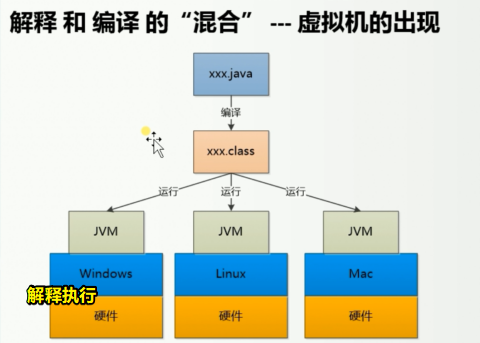
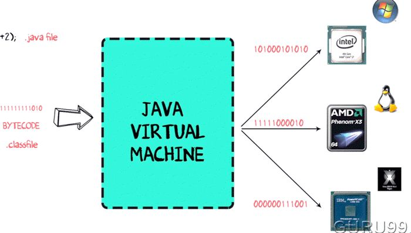
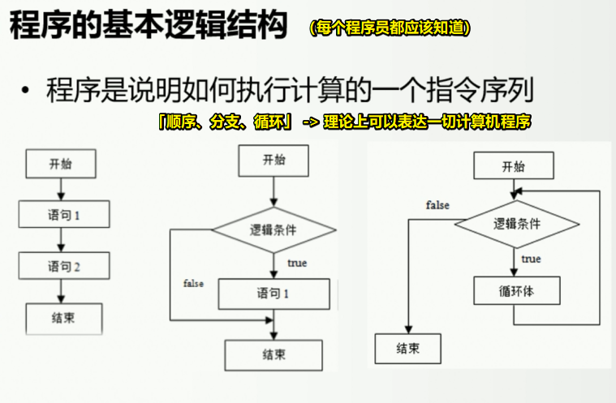
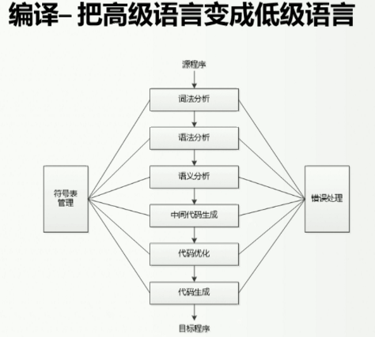
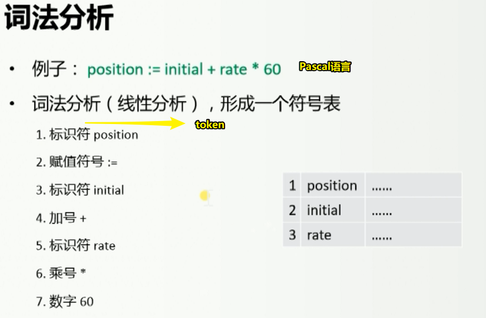
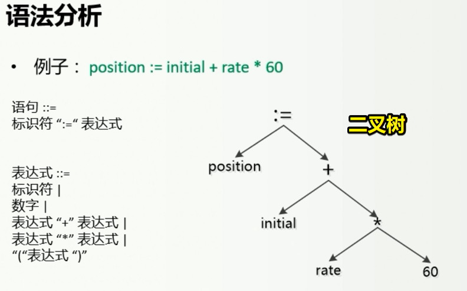
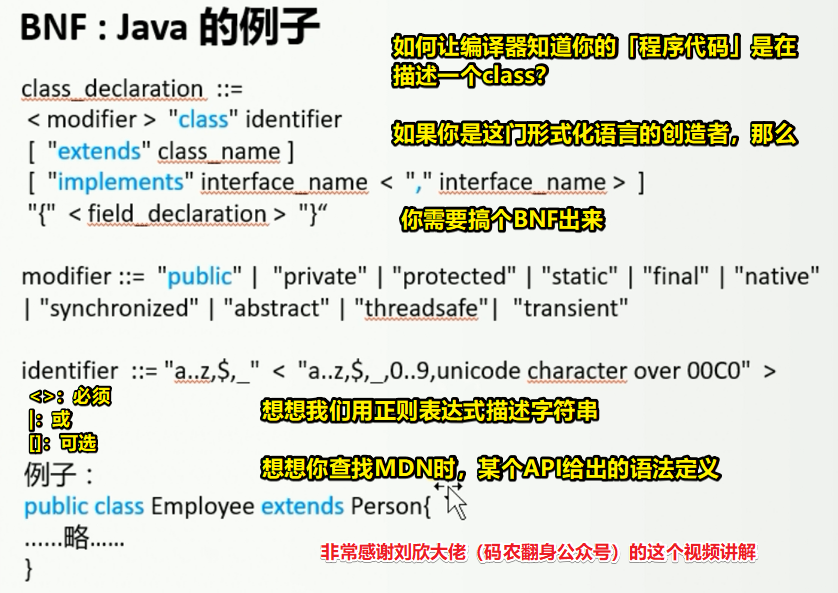
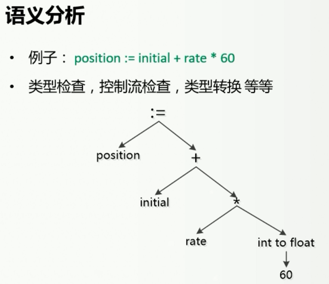
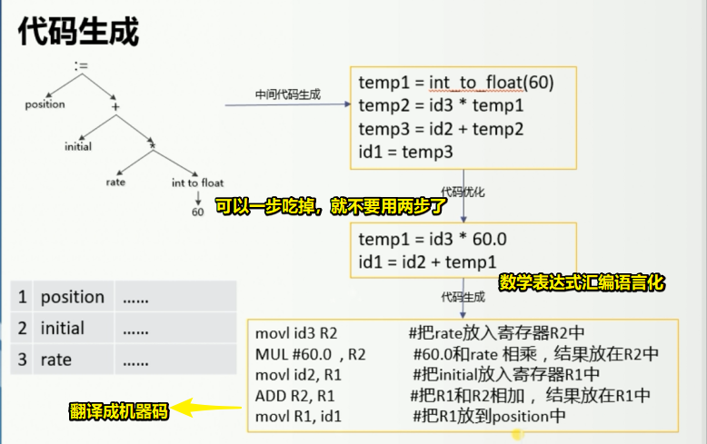

# 01-整理JS

## ★ More

### <mark>✌：「运行时、Runtime」</mark>

> **任何语言要运行都需要自己的运行时**，Java 程序的运行时叫 Java Runtime，Android 程序的运行时叫 Android Runtime，而具体 Runtime 是个什么东西呢，就是说一个程序要在一个硬件或者平台上跑，就必须要有一个中间层用来把程序语言转换为机器能听懂的机器语言。

Runtime是一种简称 -> 在这里指的是「runtime system」 -> 而这个「runtime system」又被称作「run-time system, runtime environment or run-time environment」

Java Runtime <=> Java Runtime Environment（JRE）

> Node.js is an open-source, cross-platform, JavaScript runtime environment. It executes JavaScript code outside of a browser. 

➹：[什么是运行时（Runtime） - 咕咚](https://gudong.site/2019/04/05/about-runtime.html)

➹：[terminology - What is "runtime"? - Stack Overflow](https://stackoverflow.com/questions/3900549/what-is-runtime)

➹：[Runtime - Wikipedia](https://en.wikipedia.org/wiki/Runtime)

➹：[Runtime system - Wikipedia](https://en.wikipedia.org/wiki/Runtime_system)

➹：[运行时（runtime）是什么意思？应该怎样深入且直观地理解？ - 知乎](https://www.zhihu.com/question/20607178)

### <mark>✌：「数学建模」</mark>

➹：[数学建模的模型指的是什么？ - 知乎](https://www.zhihu.com/question/57617846)

➹：[国防科技大学公开课：数学建模——从自然走向理性之路 - 网易公开课](http://open.163.com/newview/movie/free?pid=M8PTB9ADF&mid=M8PUT0897)

### <mark>✌：「为啥这个问题就成了哲学问题了呢？而哲学问题只能让哲学家去讨论？」</mark>

➹： [“今晚吃什么”是一个哲学问题吗？ - 知乎](https://www.zhihu.com/question/312633661)

➹：[哲学问题有答案吗？ - 知乎](https://www.zhihu.com/question/322370061)

➹：[你如何确定的知道你所知道的是确定的？ - 知乎](https://www.zhihu.com/question/303650927)

### <mark>✌：「模型是个什么意思？」</mark>

➹：[BIM核心理念谈4：模型是什么 - 知乎](https://zhuanlan.zhihu.com/p/25681399)

➹：[什么是思维模型？什么是原则？ - 知乎](https://zhuanlan.zhihu.com/p/41871516)

➹：[投行常说的「模型」(model) 是什么东西？ - 知乎](https://www.zhihu.com/question/27031429)

### <mark>✌：「JS有虚拟机吗？」</mark>

问题缘由：

> 如何理解「Java程序一次编译，到处运行」
> 
> Java程序通过编译生成了字节码（x.class） -> JVM将字节码文件翻译成机器语言
> 
> 不同平台下编译生成的字节码是一样的，但是由JVM翻译成的机器码却不一样
> 
> 注意：跨平台的是Java程序，不是JVM。JVM是用C/C++开发的，是编译后的机器码，不能跨平台，不同平台下需要安装不同版本的JVM。

从以下这两个链接里边：

➹：[JavaScript 虚拟机和 JVM 之间是否有联系？ - 知乎](https://www.zhihu.com/question/20023241)

➹：[JavaScript引擎、虚拟机、运行时环境是一回事儿吗？ - 知乎](https://www.zhihu.com/question/39499036)

我了解到「Engine，VM，Runtime」这三个名词，在JavaScript这个语境下经常被混用

为啥我们很少叫类似 V8 引擎这样的东西为 JS虚拟机呢？ -> 因为它不只是基于字节码的，还有部分是基于源码的，因此一般叫它为JS解释器……

那么JS引擎在解释执行一份代码之前，是否会编译一下呢？因为虚拟机是解释和编译的「混合」呀，既然这个三个名词在JS这个语境下经常被混用，那么我是否可以认为运行一段JS代码，这其中会涉及到编译的过程呢？

➹：[JavaScript到底是解释型语言还是编译型语言? - 个人文章 - SegmentFault 思否](https://segmentfault.com/a/1190000013126460)

JS引擎搞虚拟机是为了性能问题……不搞虚拟机，纯解释也是可以的……

所以我们叫JS为解释型语言，而不是编译型语言……

➹：[java是如何实现跨平台的？ - 知乎](https://www.zhihu.com/question/30753144)

➹：[都哪些编程语言是跨平台的？ - 知乎](https://www.zhihu.com/question/40527999)

➹：[为什么有这么多人吐槽java的跨平台，说什么java跨平台就是鸡肋? - 知乎](https://www.zhihu.com/question/307154586)

➹：[处理器架构、指令集和汇编语言，三者有何关系？ - 知乎](https://www.zhihu.com/question/23474438)

➹：[漫话CPU指令集架构 - 知乎](https://zhuanlan.zhihu.com/p/46170108)

### <mark>✌：Java程序的跨平台？</mark>

> 注意，JVM不是跨平台的，不同的平台需要安装不同版本的JVM，而这些JVM拿到的都是同一份字节码！

### <mark>✌：「程序的基本逻辑结构」</mark>

> 面向对象 -> 最后也会被编译成这三种控制语句之一……

➹：[序列 - 维基百科，自由的百科全书](https://zh.wikipedia.org/wiki/%E5%BA%8F%E5%88%97)

➹：[序列到序列模型，了解一下 - 知乎](https://zhuanlan.zhihu.com/p/38816145)

### <mark>✌：「BNF」</mark>

问题缘由：

**编译有以下过程：**

**词法分析是这样的：**

**语法分析：**

> 把符号表做成一棵树……

形式化语言描述方式——BNF

> 语法：乘法的优先级高于加法……

如何定义一门语言？ -> 让源代码符合某种格式？

➹：[BNF范式（巴科斯范式）到底是什么？ - 知乎](https://www.zhihu.com/question/27051306)

➹：[巴科斯范式_百度百科](https://baike.baidu.com/item/%E5%B7%B4%E7%A7%91%E6%96%AF%E8%8C%83%E5%BC%8F/1849549?fromtitle=BNF&fromid=7328753)

➹：[Backus–Naur form - Wikipedia](https://en.wikipedia.org/wiki/Backus%E2%80%93Naur_form)

**语义分析：**

> 比较重要的一步

> 编程语言语义，就是**这段代码实际的含义**。编程语言的代码必须有绝对明确的含义，这样人们才能让程序做自己想做的事情。
> 
> 比如最简单的一行代码：`a = 1;` 它的语义是“将32位整型常量存储到变量`a`中”。首先我们对“`1`”有明确的定义，它是32位有符号整型字面量，这里“32位有符号整型”就是表达式“`1`”的**类型**。其次，这句话成为合法的编程语言，32位整型常量必须能够隐式转换为a的类型。假设a就是int型变量，那么这条语句就直接将1存储到a所在内存里。如果a是浮点数类型的，那么这句话就隐含着将**整型常量`1`**转换为**浮点类型**的步骤。在语义分析中，**类型检查**是贯穿始终的一个步骤。

上边的图中，rate是个float类型的值，所以需要把int 的60隐式转换为 float 的60……

➹：[自己动手开发编译器（十一）语义分析 - 装配脑袋 - 博客园](https://www.cnblogs.com/ninputer/archive/2011/07/22/2112030.html)

➹：[聊聊编译原理（三） - 语义分析 - 御坂研究所](https://www.nosuchfield.com/2017/08/20/Talk-about-compilation-principles-3/)

➹：[语义分析是什么？他们的表现形式是怎样的。 - 知乎](https://www.zhihu.com/question/21290927)

➹：[语义分析 - 知乎](https://www.zhihu.com/topic/19632473/hot)

**代码生成：**

> 数学运算变成汇编语言 -> 把汇编语言翻译成机器语言

以上就是一个非常非常简单的表达式程序代码被翻译成目标代码的这么一个过程了……

一般真实的程序是非常非常复杂的 -> 放大一下规模 -> 想想大量的if……else，各处跳转等乱七八糟的一大堆东西，你说把这样的程序最终搞成是汇编代码，简单不？

