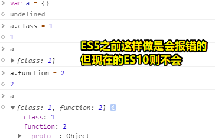

# 01-整理JS

## ★产出

## ★解释

同学HTML一样，我们对JS 也是从维度的角度去看

但JS是门编程语言，而学所有编程语言都有一个通用的方法论，即可这样看一门语言：

- JS
  - Grammar
  - 语义
  - 运行时

> Grammar分为lex和syntax（同HTML作为计算机语言看一样，即分为词法和语法），但我们翻译的时候，Grammar可以叫做语法，而syntax也叫做语法，但它们俩其实是总分关系，所以我们在这里写的是「Grammar」，而不是「语法」，不然写语法的话，就与syntax有冲突了……

> semantics（语义）与syntax（语法）这俩单词长得有点像，一般来说，它们俩关联比较紧密

### <mark>1）词法</mark>

如何看这东西？（标准的A附录）

Lexical是Lex这个名词的形容词形式，简单来说它就是词法之意

在词法里边，规定了一个输入的基本元素是啥样的，所有的语言都有一个「Input Element」的概念，即**输入的最小元素**

而在JS里边有四种「Input Element」，但winter认为这是一种神经病一样的设计，总之这种设计是为了特殊的语法结构，当然，这对于我们而言，并不需要去探讨……

> Div有区分、分开之意

我们只需要关注几种基本的输入即可，如：

- WhiteSpace
- LineTerminator
- Comment
- Token

> 为啥不是Common Token，而是Token？ -> winter说这是按照逻辑去理的，因为要从逻辑上避开JS 的这种语法和词法的特殊性技巧，总之，它只有四类的输入元素

#### 1、WhiteSpace

就是空格之意，JS支持unicode里边所有表示空白的空格，如「灵魂空格写代码」：

> 复制返回的那个字符串，然后粘贴，客观上还是可以起到「`var a = 1`」这样的作用 -> 这个可以忽悠人，我们假装给他看 `vara = 1`这样的代码，然后告诉他说我可以对这代码施展魔法，让浏览器不报错……然后运行一下……结果他一定会傻眼…… -> 魔法代码

从完备性的角度来看，任何一个合法的unicode的whitespace都可以作为JS 的whitespace来使用……

#### 2、LineTerminator

换行符，其实就是打个回车啦！

其实，在一些语言里边，换行符也被归为whitespace，因此，其实从通用语言的角度来看，词法就分为「whitespace」、「comment」、「Token」

那么为啥JS会搞出那么几个input Element呢？

之前JS就两个，一个是`InputElementDiv`，另一个则是`InputElementRegExp`，像 `RightBracePunctuator`、`CommonToken`、`DivPunctuator`、`RightBracePunctuator`等这样的都属于Token

只是词法里边有一些冲突，所以必须得定义这么多个，但winter认为这样不太好，因为这过于伪代码了……

总之，我们从概念上理解的话，它一共有4类的输入

#### 3、Comment

同whitespace和LineTerminator一样，注释也没啥好讲的

#### 4、Token

前三类输入很简单，最复杂的是Token

那么Token有什么呢？——它分为以下这么几类：

还有一个`RegularExpressionLiteral`

**①Identifier & keywords & FutureReservedWord：**

标识符，俗称变量名，由于它既可叫做函数名又可叫做属性名，所以叫做Identifier

为啥标准里边把Identifier和keywords塞到在一起，搞成是「IdentifierName」呢？

因为ES5之后，你写 `a.class`、`a.function`等这样的属性是合法的，但在ES5之前，这样写是不合法的，即合在一起，keywords也可以作为属性名了，但一般我们都不会用keywords作为属性名

所以我们在这里做了一个拆分

**②Punctuator（符号）：**

> 除号`/`，为了处理正则表达式的冲突

➹：[javascript - What does `InputElementDiv` stand for in ECMAScript lexical grammar - Stack Overflow](https://stackoverflow.com/questions/45722082/what-does-inputelementdiv-stand-for-in-ecmascript-lexical-grammar)

**③NumericLiteral、StringLiteral、RegularExpressionLiteral：**

都是直接量，即直接写一个东西，如写个2.3就是数值2.3，同理0.1、0.3也是如此，但0.1就是真得0.1吗？（不是哈！）

也可以叫字面量、直接值等等，不同翻译不同叫法

JS的特色：语法上能实现正则表达式，如new一个正则出来，但就是搞个 `/regularExpression/`这样的字面量

**④Template：**

字符串模板 -> 特别坑

本来在ES5里边，input Element是两个，但现在ES10这个版本则是4个了，而这就是Template搞的鬼！

#### 5、小结

Lex这个内容，基本上可以把JS里边所有的内容都给覆盖一遍，即你写的任何一个有效的JS里边，都离不开这个词法，即Token+辅助的空白符、注释、换行符，不过这个时候，对这些东西的理解只限于这单个这样的一个一个的词

还需要用语法（syntax）去把它们整合到一起

token的意思：

这个单字的翻译很神奇，我们可以理解它为「**有效的输入元素**」 -> 没有一个好的中文词可以对应这个token

总之，有用的东西就是token，没有用的就是空白符、注释、换行符，想想我们在一个正常语言里边，空白符等这三个东西是被我们给忽略掉的，而token则没有被忽略掉，因为它是有用的，所以有用的才是token

在鉴权的时候也会用到token（这不是JS语境下的token），如果拿中文字面意思（记号、小标记）去理解它的话是不可能理解的 -> 你用多了，才会理解它的意思

### <mark>2）语法</mark>

简单分一下类：

根据A2~A5的标题来分

这些都是不同的语法结构 -> 一种面向语言实现者的比较友好的表达方式（如何描述一门形式语言），逐级形成语法树的这么一个过程

> 去掉一些东西才能变成AST树，目前只能叫做语法树

语法描述 -> 什么东西可以被拆解成什么样的结构 -> 这些结构是计算机去理解的一种方式

> 理解JS代码的时候，不需要把代码转化成语法树，然后去理解…… -> 如果你不懂一些语法结构，那么你就去标准里边参考参考 -> 参考列表（有全面的语法结构给你看）

总体上看A2~A5：

- 是一个从小到大的这么一个过程 -> 从「小小的词法结构」聚合成「表达式结构」，再往上，聚合成「语句结构」，同理，往上「Functions and Classes」、「Scripts and Modules」

winter整理成这样：

解释：

- Atom：就是Identifier、Keywords等这些东西，这些东西也有执行的规则，所以也有语法的称呼
- Structure：在一些语言里边，它会把function和process分开，即它有「过程」和「函数」的区分，在C系语言里边，如C、C++、JS、Java、Python等这些偏C系的语言里边（Ruby不算），在这条线里边，基本上都咩有独立的process，而像Pascal这一系列就有把函数和process分开的这种习惯，所以从**通用的角度**去看的话，winter就搞成是Structure了，而不是function……

总之，从一个比较通用的角度去理解的话，对JS的Syntax分成4个就差不多了……

### <mark>3）语义</mark>

语义其实是跟着语法走的，别看它们俩虽然在不同的层级，但它们是一一对应的，如**你有一个语法结构，那么就会有一个对应的语义**

在标准里边，讲一个语法结构，会对应着一个语义来讲

如，讲个 `if` -> 把if的语法和语义都一起讲了

### <mark>4）运行时</mark>

运行时它整个的逻辑结构跟前边说到的语法和语义完全不一样

为啥说不一样呢？

运行时里边有「Type」 -> 从基本的token到expression，这里边都有「type」的参与，甚至「Structure」里边也有「type」的参与 -> Type是一个独立的运行时结构

> Type？万金油？

#### 1、Type

Type有七种基本类型 -> Number……

还有一个内部类型（俗称「**只存在于规范里的抽象类型**」），如Reference…… -> 这些东西都是用来解释不同阶段的东西，如Reference类型，JS开发者永远都无法得到这个类型的值，但是它可以解释delete这样的东西，如果没有Reference这个类型在运行时里边，你就无法解释这种现象：

按理说，`a.b` 和 `3` 是同一个值，但其实并不是，因为`a.b`执行的结果，其实是一个Reference类型，而这个Reference类型，在任何计算之前都会被变成这个3，即变成了引用的东西

总之，虽然你把`a.b`赋值为3，但它跟`3`并不完全等同，所以运行时必须要有reference这样一个概念……

总之，**这是用来给你解释不同语言里边不同机制，以及不同行为的**

> 你在写JS的过程中，直觉上遇到代码执行的不合理现象，那么你可以欺骗自己用「内部类型」来解释这种现象…… -> 虽然不理解，但我还是可以给自己一个理由，然后放弃对这个不合理现象的深究……

#### 2、执行过程

运行时除了有Type以外，还有一个「执行过程」

整个JS的执行是这么一个过程：

整个JS的执行从「Job Queues」（任务队列，Job有工作、职责等这样的翻译）开始

想象一下，如果我们是C++的使用者，或者是浏览器的使用者，那么我们执行JS代码，首先我们会初始化一个JS引擎，而这个时候JS引擎第一个产生的，就是「Job Queues」啦！

然后，我们再把一段一段的JS代码扔给这个JS引擎 -> 它就会在「Job Queues」里边工作 -> 所以就有了「 EnqueueJob 」(将Job加入队列)这样一个基础施设 -> 这里边会有RunJobs

RunJobs -> 所有一切的开始：

8.6这一节是「运行时」的根本

整个JS的运行过程、原理都在这一节讲完了，如果你写一个JS引擎，那么这一节RunJobs就是它的**入口函数** -> 启动JS引擎的步骤

从RunJobs开始，依次往下，一级级的会有如Promise这样的东西，看看会产生什么样的任务

JS引擎一级级地往下执行，直到最下层，每一级都需要很多的运行时施设去支持

理解了每个步骤这些东西的执行过程，我们就了解了整个JS到底是怎么执行的

像大家常说的「预编译」（JS语境下），其实跟真正的「预编译」是两回事哈！真正的预编译就是提前把代码变成binary，然后存到内存里边，而前端同学说的，就是提前把变量提前、function提前这么一个过程

总之，你去理解JS，那么你就去理解JS它的整个运行时里边的执行过程里边有哪些基础施设，如Job这个基础施设就得把该有的对象给初始化（init）好，如`Function`这个构造器是啥时候构造的……

### <mark>5）小结</mark>

- 对JS建立了一个整体概念，JS的知识体系到底长啥样？JS到底怎么学？它的边界在哪？
- 对JS的整理具有完备性 -> 没有漏东西 -> 如JS的执行过程 -> 从大到小 -> 最大大不过Job，最小小不过Identifier、Literal这样的东西 -> 所以你想学JS，那么你得先有这么一个目录，你发现哪些不会，发现哪些问题，就可以很快根据这个目录定位到这个问题是归谁管的 -> 目录的存在，让你的脑海中存在这么一个概念——哪些重要，哪些不重要，这样在学习的时候，会更有效率……
- 以上就是整个JS整理的内容了……

## ★ More

### <mark>✌：「运行时、Runtime」</mark>

> **任何语言要运行都需要自己的运行时**，Java 程序的运行时叫 Java Runtime，Android 程序的运行时叫 Android Runtime，而具体 Runtime 是个什么东西呢，就是说一个程序要在一个硬件或者平台上跑，就必须要有一个中间层用来把程序语言转换为机器能听懂的机器语言。

Runtime是一种简称 -> 在这里指的是「runtime system」 -> 而这个「runtime system」又被称作「run-time system, runtime environment or run-time environment」

Java Runtime <=> Java Runtime Environment（JRE）

> Node.js is an open-source, cross-platform, JavaScript runtime environment. It executes JavaScript code outside of a browser. 

➹：[什么是运行时（Runtime） - 咕咚](https://gudong.site/2019/04/05/about-runtime.html)

➹：[terminology - What is "runtime"? - Stack Overflow](https://stackoverflow.com/questions/3900549/what-is-runtime)

➹：[Runtime - Wikipedia](https://en.wikipedia.org/wiki/Runtime)

➹：[Runtime system - Wikipedia](https://en.wikipedia.org/wiki/Runtime_system)

➹：[运行时（runtime）是什么意思？应该怎样深入且直观地理解？ - 知乎](https://www.zhihu.com/question/20607178)

### <mark>✌：「数学建模」</mark>

➹：[数学建模的模型指的是什么？ - 知乎](https://www.zhihu.com/question/57617846)

➹：[国防科技大学公开课：数学建模——从自然走向理性之路 - 网易公开课](http://open.163.com/newview/movie/free?pid=M8PTB9ADF&mid=M8PUT0897)

### <mark>✌：「为啥这个问题就成了哲学问题了呢？而哲学问题只能让哲学家去讨论？」</mark>

➹： [“今晚吃什么”是一个哲学问题吗？ - 知乎](https://www.zhihu.com/question/312633661)

➹：[哲学问题有答案吗？ - 知乎](https://www.zhihu.com/question/322370061)

➹：[你如何确定的知道你所知道的是确定的？ - 知乎](https://www.zhihu.com/question/303650927)

### <mark>✌：「模型是个什么意思？」</mark>

➹：[BIM核心理念谈4：模型是什么 - 知乎](https://zhuanlan.zhihu.com/p/25681399)

➹：[什么是思维模型？什么是原则？ - 知乎](https://zhuanlan.zhihu.com/p/41871516)

➹：[投行常说的「模型」(model) 是什么东西？ - 知乎](https://www.zhihu.com/question/27031429)

### <mark>✌：「JS有虚拟机吗？」</mark>

问题缘由：

> 如何理解「Java程序一次编译，到处运行」
> 
> Java程序通过编译生成了字节码（x.class） -> JVM将字节码文件翻译成机器语言
> 
> 不同平台下编译生成的字节码是一样的，但是由JVM翻译成的机器码却不一样
> 
> 注意：跨平台的是Java程序，不是JVM。JVM是用C/C++开发的，是编译后的机器码，不能跨平台，不同平台下需要安装不同版本的JVM。

从以下这两个链接里边：

➹：[JavaScript 虚拟机和 JVM 之间是否有联系？ - 知乎](https://www.zhihu.com/question/20023241)

➹：[JavaScript引擎、虚拟机、运行时环境是一回事儿吗？ - 知乎](https://www.zhihu.com/question/39499036)

我了解到「Engine，VM，Runtime」这三个名词，在JavaScript这个语境下经常被混用

为啥我们很少叫类似 V8 引擎这样的东西为 JS虚拟机呢？ -> 因为它不只是基于字节码的，还有部分是基于源码的，因此一般叫它为JS解释器……

那么JS引擎在解释执行一份代码之前，是否会编译一下呢？因为虚拟机是解释和编译的「混合」呀，既然这个三个名词在JS这个语境下经常被混用，那么我是否可以认为运行一段JS代码，这其中会涉及到编译的过程呢？

➹：[JavaScript到底是解释型语言还是编译型语言? - 个人文章 - SegmentFault 思否](https://segmentfault.com/a/1190000013126460)

JS引擎搞虚拟机是为了性能问题……不搞虚拟机，纯解释也是可以的……

所以我们叫JS为解释型语言，而不是编译型语言……

➹：[java是如何实现跨平台的？ - 知乎](https://www.zhihu.com/question/30753144)

➹：[都哪些编程语言是跨平台的？ - 知乎](https://www.zhihu.com/question/40527999)

➹：[为什么有这么多人吐槽java的跨平台，说什么java跨平台就是鸡肋? - 知乎](https://www.zhihu.com/question/307154586)

➹：[处理器架构、指令集和汇编语言，三者有何关系？ - 知乎](https://www.zhihu.com/question/23474438)

➹：[漫话CPU指令集架构 - 知乎](https://zhuanlan.zhihu.com/p/46170108)

### <mark>✌：Java程序的跨平台？</mark>

> 注意，JVM不是跨平台的，不同的平台需要安装不同版本的JVM，而这些JVM拿到的都是同一份字节码！

### <mark>✌：「程序的基本逻辑结构」</mark>

> 面向对象 -> 最后也会被编译成这三种控制语句之一……

➹：[序列 - 维基百科，自由的百科全书](https://zh.wikipedia.org/wiki/%E5%BA%8F%E5%88%97)

➹：[序列到序列模型，了解一下 - 知乎](https://zhuanlan.zhihu.com/p/38816145)

### <mark>✌：「BNF」</mark>

问题缘由：

**编译有以下过程：**

**词法分析是这样的：**

**语法分析：**

> 把符号表做成一棵树……

形式化语言描述方式——BNF

> 语法：乘法的优先级高于加法……

如何定义一门语言？ -> 让源代码符合某种格式？

➹：[BNF范式（巴科斯范式）到底是什么？ - 知乎](https://www.zhihu.com/question/27051306)

➹：[巴科斯范式_百度百科](https://baike.baidu.com/item/%E5%B7%B4%E7%A7%91%E6%96%AF%E8%8C%83%E5%BC%8F/1849549?fromtitle=BNF&fromid=7328753)

➹：[Backus–Naur form - Wikipedia](https://en.wikipedia.org/wiki/Backus%E2%80%93Naur_form)

**语义分析：**

> 比较重要的一步

> 编程语言语义，就是**这段代码实际的含义**。编程语言的代码必须有绝对明确的含义，这样人们才能让程序做自己想做的事情。
> 
> 比如最简单的一行代码：`a = 1;` 它的语义是“将32位整型常量存储到变量`a`中”。首先我们对“`1`”有明确的定义，它是32位有符号整型字面量，这里“32位有符号整型”就是表达式“`1`”的**类型**。其次，这句话成为合法的编程语言，32位整型常量必须能够隐式转换为a的类型。假设a就是int型变量，那么这条语句就直接将1存储到a所在内存里。如果a是浮点数类型的，那么这句话就隐含着将**整型常量`1`**转换为**浮点类型**的步骤。在语义分析中，**类型检查**是贯穿始终的一个步骤。

上边的图中，rate是个float类型的值，所以需要把int 的60隐式转换为 float 的60……

➹：[自己动手开发编译器（十一）语义分析 - 装配脑袋 - 博客园](https://www.cnblogs.com/ninputer/archive/2011/07/22/2112030.html)

➹：[聊聊编译原理（三） - 语义分析 - 御坂研究所](https://www.nosuchfield.com/2017/08/20/Talk-about-compilation-principles-3/)

➹：[语义分析是什么？他们的表现形式是怎样的。 - 知乎](https://www.zhihu.com/question/21290927)

➹：[语义分析 - 知乎](https://www.zhihu.com/topic/19632473/hot)

**代码生成：**

> 数学运算变成汇编语言 -> 把汇编语言翻译成机器语言

以上就是一个非常非常简单的表达式程序代码被翻译成目标代码的这么一个过程了……

一般真实的程序是非常非常复杂的 -> 放大一下规模 -> 想想大量的if……else，各处跳转等乱七八糟的一大堆东西，你说把这样的程序最终搞成是汇编代码，简单不？

### <mark>✌：「ECMA-262里边的`:::`、`::`这些符号都表示啥意思？」</mark>

- Productions of the numeric string grammar are distinguished by having three colons “`:::`” as punctuation.
- Productions of the lexical and RegExp grammars are distinguished by having two colons “`::`” as separating punctuation. The lexical and RegExp grammars share some productions.

### <mark>✌：「为啥winter写的Lex，而不是Lexical？」</mark>

wiki 说到：

> Lex is a computer program that generates lexical analyzers ("scanners" or "lexers").

➹：[lex - 维基百科，自由的百科全书](https://zh.wikipedia.org/wiki/Lex)

➹：[Lex (software) - Wikipedia](https://en.wikipedia.org/wiki/Lex_%28software%29)

➹：[Lexical analysis - Wikipedia](https://en.wikipedia.org/wiki/Lexical_analysis)

➹：[Lex & Yacc 入门 - 知乎](https://zhuanlan.zhihu.com/p/105160180)

➹：[学习编译原理只是研究lex和yacc吗？ - 知乎](https://www.zhihu.com/question/67908025)

### <mark>✌：「LineTerminator 是个什么东东？」</mark>

行终止符

➹：[为什么在 HTTP 协议中，使用的是 Windows 换行方式而不是 UNIX 换行方式？ - 知乎](https://www.zhihu.com/question/21245110)

➹：[JavaScript模式匹配提案 - 知乎](https://zhuanlan.zhihu.com/p/27941929)

➹：[网页里的电脑博物馆](http://www.dnbwg.com/index.html)

### <mark>✌：「winter对Type的划分？」</mark>

在ECMA-262（2019）的第6章——ECMAScript Data Types and Values 里边提到：

> Algorithms within this specification manipulate values each of which has an associated type. The possible value types are
exactly those defined in this clause. Types are further subclassified into ECMAScript language types and specification
types.

所以：

- Types
  - ECMAScript Language Types
  - ECMAScript Specification Types

那么「语言类型是在描述什么呢？」

> An ECMAScript language type corresponds to values that are directly manipulated by an ECMAScript programmer using the ECMAScript language. The ECMAScript language types are `Undefined, Null, Boolean, String, Symbol, Number, and Object`. An ECMAScript language value is a value that is characterized by an ECMAScript language type.

翻译过来就是：

> ECMAScript语言类型对应于由ECMAScript程序员使用ECMAScript语言直接操作的值。 ECMAScript语言类型为 Undefined、 Null、 Boolean、 String、 Symbol、 Number 和 Object。 ECMAScript语言值是以ECMAScript语言类型为特征的值。

那「ECMAScript Specification Types」呢？

> A specification type corresponds to meta-values that are used within algorithms to describe the semantics of ECMAScript language constructs and ECMAScript language types. The specification types include `Reference, List, Completion, Property Descriptor, Lexical Environment, Environment Record, and Data Block`. Specification type values are specification artefacts that do not necessarily correspond to any specific entity within an ECMAScript implementation.
Specification type values may be used to describe intermediate results of ECMAScript expression evaluation but such values cannot be stored as properties of objects or values of ECMAScript language variables.

尤大对「Specification Type」的解释（此时还没有Symbol）：

> 它是「只存在于规范里的抽象类型」，它们是为了更好地**描述语言的底层行为逻辑**才存在的，但并**不存在于实际的 js 代码中**。js 代码中存在的基本类型就只有 Undefined, Null, Boolean, String, Number 和 Object。（Array 其实是特殊的 Object）

➹：[ECMAScript 规范中的Reference Specification Type的含义? - fighterleslie的回答 - 知乎](https://www.zhihu.com/question/31911373/answer/54055480)

### <mark>✌：王垠说到「代码的本质根本就不是字符串，它本来就是一个具有复杂拓扑的数据结构，就像电路一样。」</mark>

拓扑是啥？

我们日常写的代码看上去就像是个杯子，但数学家的眼中看到的是甜甜圈……

你写的程序是你所看到的字符串，但在镜子里边是AST

➹：[对 Parser 的误解](https://www.yinwang.org/blog-cn/2015/09/19/parser)

➹：[怎样写一个解释器](https://www.yinwang.org/blog-cn/2012/08/01/interpreter)

➹：[《柴知道》科普：什么是拓扑学？扑_哔哩哔哩 (゜-゜)つロ 干杯~-bilibili](https://www.bilibili.com/video/BV1Tb411M7Ye?from=search&seid=729060281341134126)

➹：[[中字]用拓扑学计算一个人究竟有多少个“洞”[Vsauce科普]_哔哩哔哩 (゜-゜)つロ 干杯~-bilibili](https://www.bilibili.com/video/BV1rj411f7Ga/?spm_id_from=333.788.videocard.8)

➹：[人类身上到底有多少洞？_哔哩哔哩 (゜-゜)つロ 干杯~-bilibili](https://www.bilibili.com/video/av92318844/)

### <mark>✌：关于RunJobs？</mark>

➹：[ECMAScript 的 Job Queues 和 Event loop 有什么关系？ - 知乎](https://www.zhihu.com/question/40063533)

➹：[计算机基础知识之：队列，你到底排不排队？ - 知乎](https://zhuanlan.zhihu.com/p/90963774)

➹：[浅谈任务队列和任务调度 - 知乎](https://zhuanlan.zhihu.com/p/20537929)

➹：[Understanding Event Loop, Call Stack, Event & Job Queue in Javascript](https://medium.com/@Rahulx1/understanding-event-loop-call-stack-event-job-queue-in-javascript-63dcd2c71ecd)

➹：[javascript - ECMAScript : Some questions about Job and Job queue - Stack Overflow](https://stackoverflow.com/questions/50373175/ecmascript-some-questions-about-job-and-job-queue)

✌：如何阅读ECMA-262标准？

ECMAScript 6规格的26章之中，第1章到第3章是对文件本身的介绍，与语言关系不大。第4章是对这门语言总体设计的描述，有兴趣的读者可以读一下。第5章到第8章是语言宏观层面的描述。第5章是规格的名词解释和写法的介绍，第6章介绍数据类型，第7章介绍语言内部用到的抽象操作，第8章介绍代码如何运行。第9章到第26章介绍具体的语法。

对于一般用户来说，**除了第4章**，其他章节都涉及某一方面的细节，不用通读，只要在用到的时候，查阅相关章节即可。

➹：[读懂 ECMAScript 规格 - 阮一峰的网络日志](http://www.ruanyifeng.com/blog/2015/11/ecmascript-specification.html)

➹：[ECMA-262-3 in detail——第一章：执行上下文 - ECMA-262-3 in detail - 我是前端](https://www.imqianduan.com/ECMA-262-3-in-detail/execution-contexts.html)

➹：[如何正确的阅读 ECMA-262 & 读懂 ES6 官方文档？ - 知乎](https://zhuanlan.zhihu.com/p/26812708)

 

