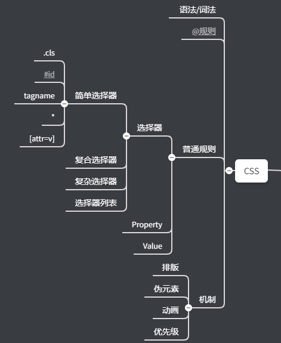

# 02-整理CSS

## ★产出



## ★解释

1）怎么找CSS里边的某个东西的语法？

同HTML、JS一样，凡是语言都会有词法和语法这俩东西

> 以后学任何一个语言都要去看它的词法和语法 -> 这俩东西是跑不了的 -> 凡是严格定义的计算机语言都得有这两个东西

CSS挺好玩的，它的乐趣在于，你看whatwg写了一份标准，包罗万象，你直接查就好了，而JS虽然更难一点，但其标准也写得很好，而CSS的乐趣在于其标准是零零碎碎的……

CSS的标准分布在不同的细碎的标准里边

如你搜索「Selector」：


W3C标准的状态：

- WD -> 最初的标准状态（你别信，虽然有这东西，但没效力）
- CR -> 候选
- PR -> 建议推荐（委员会基本已达成意见一致，听取公众意见批评）
- REC -> 正式的推荐标准（该状态已经是现行标准了，已经是很成熟的标准了，我们要看的话，就看这个状态下的标准）
- ret -> 退休了，如HTML 5、HTML 4.0.1（虽然退休了，但这不等于我们就不可以看了）

winter特别喜欢看的CSS标准是「CSS 2.1」

➹：[Grammar of CSS 2.1](https://www.w3.org/TR/2011/REC-CSS2-20110607/grammar.html#grammar)

为啥喜欢看呢？

因为这是一份非常完整的CSS哈！虽然CSS 3的特性它是没有的，但是该标准里边写到的「Grammar」是一份很完整的Grammar

而CSS3它的Grammar是散在各种各样的特性里边去的 -> 意味着「非常的难找」

➹：[CSS Syntax Module Level 3](https://www.w3.org/TR/css-syntax-3/)

虽然这份文档里边，很贴心的画了很多图，但这看了跟没看是一个样的

W3C标准写这个语法和词法是非常的神奇的，如你虽然定义了以下这些基本东西，但是这没有任何具体的语法呀：


简单来说，这是一份非常泛的定义

所以说，如果你基本看完了这份文档，但这依旧无法帮你处理任何的问题，而如果你想找具体的语法，就到具体到某个地方来，如我想看看「media query syntax」：

首先检索到：


> [Media Queries](https://www.w3.org/TR/2012/REC-css3-mediaqueries-20120619/)

定位到「syntax」：


总之，你要找CSS里边某个东西的语法，那么你得在散落在各地的CSS标准里边去找…… -> 工作量特别大

不过，幸好的是，CSS还有一个整体的语法概述——CSS 2.1 -> 节省时间

2）CSS 2.1

标准：[Cascading Style Sheets Level 2 Revision 1 (CSS 2.1) Specification](https://www.w3.org/TR/2011/REC-CSS2-20110607/)

该标准的「Grammar」一节里边，大的结构其实已经有了，但缺了一些新的特性 -> 参考意义还是很大的


根据「Lexical scanner」：


``` js
stylesheet
  : [ CHARSET_SYM STRING ';' ]?
    [S|CDO|CDC]* [ import [ CDO S* | CDC S* ]* ]*
    [ [ ruleset | media | page ] [ CDO S* | CDC S* ]* ]*
  ;
```

不要因为看到上边这样的东西，就被吓到，去掉一些无关紧要的东西：

``` js
stylesheet
  : [ CHARSET_SYM STRING ';' ]?
    [ import ]*
    [ [ ruleset | media | page ] ]*
  ;
```

> `CHARSET_SYM` -> SYM -> symbol

一个样式表，大概分成三个部分：

- 第一部分：`CHARSET_SYM`表示`"@charset "`这个字 -> 这标准告诉我们「`"@charset "`在最前边，可以没有（`?`表示0或1）」
- 第二部分：`import`就是import symbol开头的 -> `@{I}{M}{P}{O}{R}{T}` -> 可以大写小写 -> 结合第一部分来看，表示如果有`@charset`那就`@charset`在前，如果没有那就`@import`在前，总之，同时存在`@charset`、`@import`，那么`@charset`一定要在最前边
- 第三部分，可以有三种东西
  - ruleset -> 字面意思可知，这是CSS规则
  - media -> `MEDIA_SYM`开头的东西 -> CSS 2.1没有media query，但它有media rule
  - page -> @page -> 打印页面时候设置个别属性，如 `margin`等这样的属性会用到


