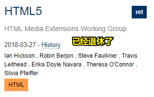

# 02-整理CSS

## ★产出


## ★解释

### <mark>1）怎么找CSS里边的某个东西的语法？</mark>

同HTML、JS一样，凡是语言都会有词法和语法这俩东西

> 以后学任何一个语言都要去看它的词法和语法 -> 这俩东西是跑不了的 -> 凡是严格定义的计算机语言都得有这两个东西

CSS挺好玩的，它的乐趣在于，你看whatwg写了一份标准，包罗万象，你直接查就好了，而JS虽然更难一点，但其标准也写得很好，而CSS的乐趣在于其标准是零零碎碎的……

CSS的标准分布在不同的细碎的标准里边

如你搜索「Selector」：


W3C标准的状态：

- WD -> 最初的标准状态（你别信，虽然有这东西，但没效力）
- CR -> 候选
- PR -> 建议推荐（委员会基本已达成意见一致，听取公众意见批评）
- REC -> 正式的推荐标准（该状态已经是现行标准了，已经是很成熟的标准了，我们要看的话，就看这个状态下的标准）
- ret -> 退休了，如HTML 5、HTML 4.0.1（虽然退休了，但这不等于我们就不可以看了）

winter特别喜欢看的CSS标准是「CSS 2.1」

➹：[Grammar of CSS 2.1](https://www.w3.org/TR/2011/REC-CSS2-20110607/grammar.html#grammar)

为啥喜欢看呢？

因为这是一份非常完整的CSS哈！虽然CSS 3的特性它是没有的，但是该标准里边写到的「Grammar」是一份很完整的Grammar

而CSS3它的Grammar是散在各种各样的特性里边去的 -> 意味着「非常的难找」

➹：[CSS Syntax Module Level 3](https://www.w3.org/TR/css-syntax-3/)

虽然这份文档里边，很贴心的画了很多图，但这看了跟没看是一个样的

W3C标准写这个语法和词法是非常的神奇的，如你虽然定义了以下这些基本东西，但是这没有任何具体的语法呀：


简单来说，这是一份非常泛的定义

所以说，如果你基本看完了这份文档，但这依旧无法帮你处理任何的问题，而如果你想找具体的语法，就到具体到某个地方来，如我想看看「media query syntax」：

首先检索到：


> [Media Queries](https://www.w3.org/TR/2012/REC-css3-mediaqueries-20120619/)

定位到「syntax」：


总之，你要找CSS里边某个东西的语法，那么你得在散落在各地的CSS标准里边去找…… -> 工作量特别大

不过，幸好的是，CSS还有一个整体的语法概述——CSS 2.1 -> 节省时间

### <mark>2）CSS 2.1</mark>

#### 1、`@`规则

标准：[Cascading Style Sheets Level 2 Revision 1 (CSS 2.1) Specification](https://www.w3.org/TR/2011/REC-CSS2-20110607/)

该标准的「Grammar」一节里边，大的结构其实已经有了，但缺了一些新的特性 -> 参考意义还是很大的


根据「Lexical scanner」：


``` js
stylesheet
  : [ CHARSET_SYM STRING ';' ]?
    [S|CDO|CDC]* [ import [ CDO S* | CDC S* ]* ]*
    [ [ ruleset | media | page ] [ CDO S* | CDC S* ]* ]*
  ;
```

不要因为看到上边这样的东西，就被吓到，去掉一些无关紧要的东西：

``` js
stylesheet
  : [ CHARSET_SYM STRING ';' ]?
    [ import ]*
    [ [ ruleset | media | page ] ]*
  ;
```

> `CHARSET_SYM` -> SYM -> symbol

一个样式表，大概分成三个部分：

- 第一部分：`CHARSET_SYM`表示`"@charset "`这个字 -> 这标准告诉我们「`"@charset "`在最前边，可以没有（`?`表示0或1）」
- 第二部分：`import`就是import symbol开头的 -> `@{I}{M}{P}{O}{R}{T}` -> 可以大写小写 -> 结合第一部分来看，表示如果有`@charset`那就`@charset`在前，如果没有那就`@import`在前，总之，同时存在`@charset`、`@import`，那么`@charset`一定要在最前边
- 第三部分，可以有三种东西
  - ruleset -> 字面意思可知，这是CSS规则
  - media -> `MEDIA_SYM`开头的东西 -> CSS 2.1没有media query，但它有media rule
  - page -> @page -> 打印页面时候设置个别属性，如 `margin`等这样的属性会用到

可以看到CSS 2.1的这条stylesheet规则，很简单的告诉了我们几个道理：

1. @规则 -> 同时存在 `@charset ` 与 `@import `，那么`@charset `则必须在最前边 -> 也在ruleset的最上边
2. 只针对ruleset（普通规则） -> `@media`和`@page`前后无所谓
3. 只有4个带`@`的 -> 这是CSS 2.1时代的（让人感到美好的时代），之后的CSS 3时代可不止4个带`@`的

`@`规则是CSS里边一个很重要的内容！

那么`@`规则总共有哪些呢？ -> 参考「重学前端」，自己自行去整理！

#### 2、普通规则

如何整理？ -> 用分解法来搞

我们平时是如何写一个普通的CSS规则的？


那么一个普通的CSS规则分哪些部分呢？

1. 选择器
2. 列表（1条或多条样式声明）
   1. key
   2. value

我们只需要研究「选择器」「key」「value」这三部分就行了

Key -> 即是「Property」 -> 那么CSS官方给出了多少个CSS属性呢？

同理，又给出了多少种值呢？

> 属性很多，可分类来搞，而值不多，可以简单找找

**①选择器**

可分

- 简单选择器（有5种）
- 复合选择器（把简单选择器组合到一起、有4种）
- 复杂选择器（有加空格子孙这种关系）
- 选择器列表（逗号分隔）

> `#id.cls` -> 这种选择器表示啥意思？ -> 这两个选择器之间的关系是`&`的关系

最复杂的选择器大概是这种程度：

`#id a>.cls[attr],#id2` -> 多种选择器集合到一起 -> 有优先级（会有语法结构形式化体现出来）

选择器特别神奇 -> 不光是给CSS用：


➹：[Selectors Level 3](https://www.w3.org/TR/2018/REC-selectors-3-20181106/#context)

有人问「selector的优先级在哪儿？」

selector的优先级在「机制」这个地方儿，为啥在这个地方呢？而不是在「选择器」这个节点旗下呢？

你要知道「query selector」是不涉及优先级的，单独看selector，是一个很单纯的机制

Selectors 4快出来2年了，但一直是WD状态 -> 为啥呢？ -> 因为这里边设计了一些很变态的东西，如`:is()`可以往上选择父节点 -> 浏览器工程师产生了巨大的抵触情绪，因为这玩意儿实现完后，浏览器的整个性能会下降一大截…… -> 基于这卡点，卡了两年，基本上已经GG了 -> 这种基本上两年都还是WD状态的东西，基本上已经凉凉了，所以你也不用去看了……

### <mark>3）机制</mark>

相当于是CSS运行时的机制

如：

- 排版
- 伪元素
- 动画
- 优先级

等，都属于单独的机制，这些东西可以单独的拎起来展开 -> CSS规则都可以覆盖到这些机制

> 这部分内容讲到CSS的时候，才着重去讲……

## ★More

### <mark>1）在w3c标准里边，像REC这样的东西到底表示的是什么？</mark>


➹：[W3C标准流程与组织架构 - 知乎](https://zhuanlan.zhihu.com/p/36103933)

### <mark>2）色域标准？</mark>

为啥会有那么多色域标准？

人眼可见的色彩包含数百万种颜色，但扫描仪、显示器和彩色打印机等显色设备只能产生（重现）其中的一部分颜色（色彩子集），这个"子集"称为色域。因此，人们为不同的领域制定了不同的色域标准。

> 人看到的颜色种数 vs 显色设备能显示的颜色种数 -> 前者是爸爸，后者是弟弟……

有哪些色域标准？


sRGB -> 这种标准得到了W3C的支持 -> 用于互联网

> 色域并不一定是谁比谁更好，它们都有其特定的专精用途。近年来，随着广色域的普及，我们可以期待显色设备给我们带来更出色的色彩表现。

➹：[浅谈几种常见的色域标准 - 知乎](https://zhuanlan.zhihu.com/p/45533004)

### <mark>3）HTML5已经退休了？</mark>



目前看的HTML版本：


➹：[[译]HTML 5.2新特性 - 知乎](https://zhuanlan.zhihu.com/p/33174266)

### <mark>4）我们可以去阅读的CSS版本？</mark>


> 语法写的标准

➹：[Grammar of CSS 2.1](https://www.w3.org/TR/2011/REC-CSS2-20110607/grammar.html#grammar)

### <mark>5）CSS有多少种属性？有多少种值？</mark>

### <mark>6）CSS标准总览？</mark>

➹：[All CSS specifications](https://www.w3.org/Style/CSS/specs.en.html)

### <mark>7）一些讲CSS的文档？</mark>

➹：[CSS - Syntax - Tutorialspoint](https://www.tutorialspoint.com/css/css_syntax.htm)

### <mark>8）`@charset`和`@import`在CSS里边是如何写的？</mark>

``` css
@charset "utf-8";
@import 'custom.css';
```

形式语法（Formal syntax）：

``` css
@charset "<charset>";
@import [ <string> | <url> ] [ <media-query-list> ]?;
```

➹：[@charset - CSS: Cascading Style Sheets - MDN](https://developer.mozilla.org/en-US/docs/Web/CSS/@charset)

➹：[@import - CSS: Cascading Style Sheets - MDN](https://developer.mozilla.org/en-US/docs/Web/CSS/@import)

### <mark>9）`@media`和`@page`都是些什么东西？</mark>

media types 是样式表最重要的特性之一 -> 它们规定了文档如何在不同的媒体上呈现: 屏幕上、纸上、语音合成器、盲文设备等等

某些 CSS 属性仅适用于某些媒体，但是，有时不同媒体类型的样式表可能会共享一个CSS属性，不过，这通常都得要求该属性具有不同的值，如 `font-size`这个属性，对 `screen` 和 `print`这两类媒体都很有用，由于这两种媒体类型差别很大，因此，我们需要为这共同属性设置不同的值; document在计算机屏幕上通常需要比在纸上使用更大的字体，所以，有必要直接让样式表或样式表的一部分适用于某些媒体类型

例子：

``` css
@import url("fancyfonts.css") screen;
@media print {
  /* style sheet for print goes here */
}

@media print {
  body { font-size: 10pt }
}
@media screen {
  body { font-size: 13px }
}
@media screen, print {
  body { line-height: 1.2 }
}
```

> 媒体类型名称不区分大小写。CSS 2.1是没有媒体查询这个概念的……

CSS 2时代的媒体类型 vs CSS 3时代的媒体查询：

看完之前的笔记：[第1章 前期准备 - imooc](https://ppambler.github.io/imooc/01-%E6%89%80%E5%90%91%E6%8A%AB%E9%9D%A1%E7%9A%84%E5%93%8D%E5%BA%94%E5%BC%8F%E5%BC%80%E5%8F%91/%E7%AC%AC1%E7%AB%A0-%E5%89%8D%E6%9C%9F%E5%87%86%E5%A4%87.html#1-6-%E5%AA%92%E4%BD%93%E6%9F%A5%E8%AF%A2-1)

> 以前写这个笔记的时候，没有感受到为啥老师要对比一下CSS2.1，现在看来，这老师是真得牛逼！

那么 `@page`呢？

`@page` 规则用于在打印文档时修改某些CSS属性。你不能用`@page`规则来修改所有的CSS属性，而是只能修改「页边距（margins）」、「orphans」、「widows」、「分页符（page breaks）」这4个属性。除了这4个属性以外，你对其它的CSS属性的修改是无效的

例子：

``` css
@page {
  margin: 1cm;
}

@page :first {
  margin: 2cm;
}
```

➹：[Media types](https://www.w3.org/TR/2011/REC-CSS2-20110607/media.html#q7.0)

➹：[Media Queries](https://www.w3.org/TR/2012/REC-css3-mediaqueries-20120619/)

➹：[@media - CSS: Cascading Style Sheets - MDN](https://developer.mozilla.org/en-US/docs/Web/CSS/@media)

➹：[深入理解CSS Media媒体查询 - 小火柴的蓝色理想 - 博客园](https://www.cnblogs.com/xiaohuochai/p/5848612.html)

➹：[CSS媒体查询 - 掘金](https://juejin.im/post/5affd7ff6fb9a07aa2139ebb)

➹：[@page - CSS: Cascading Style Sheets - MDN](https://developer.mozilla.org/en-US/docs/Web/CSS/@page)

➹：[CSS 打印 - 龙墨 - SegmentFault 思否](https://segmentfault.com/a/1190000010145260)

### <mark>10）winter在他的「重学专栏」里边，写到「标准对CSS语法的描述使用了类似LL语法分析的伪代码，而且没有描述任何具体的规则」，那么「LL语法」是什么呢？</mark>

➹：[实现一个四则运算语法解析器 - 知乎](https://zhuanlan.zhihu.com/p/112460676)

➹：[你知道LL(1)吗 - 知乎](https://zhuanlan.zhihu.com/p/122571100)

➹：[前端工程师为什么要学习编译原理？ - 知乎](https://zhuanlan.zhihu.com/p/31096468)

➹：[JS背后的秘密(上) — Compling of JavaScript - 知乎](https://zhuanlan.zhihu.com/p/49341474)

➹：[LL(1)语法分析过程 - 知乎](https://zhuanlan.zhihu.com/p/65239668)

➹：[语法分析 | LL(1) 分析算法 - 知乎](https://zhuanlan.zhihu.com/p/31301086)

➹：[前端对AST（抽象语法树）的应用越来越多，应该看什么书籍才能补充这方面的知识点？ - 知乎](https://www.zhihu.com/question/268622554)

➹：[jacksplwxy/JavaScript-compiler: 编译器教程，使用TypeScript实现一款简易JavaScript编译器](https://github.com/jacksplwxy/JavaScript-compiler)

### <mark>11）CSS有哪些`@`规则？</mark>

➹：[博闻强识：了解CSS中的@ AT规则 « 张鑫旭-鑫空间-鑫生活](https://www.zhangxinxu.com/wordpress/2015/08/know-css-at-rules/)

➹：[At-rules - CSS: Cascading Style Sheets - MDN](https://developer.mozilla.org/en-US/docs/Web/CSS/At-rule)

➹：[The At-Rules of CSS - CSS-Tricks](https://css-tricks.com/the-at-rules-of-css/)

➹：[探究 CSS 解析原理 - Jartto's blog](http://jartto.wang/2017/11/13/Exploring-the-principle-of-CSS-parsing/)

### <mark>12）CSS有多少种属性？以及有多少种值？</mark>

➹：[CSS 那么多属性，而且每个属性都有多个值怎么记？ - 知乎](https://www.zhihu.com/question/31317160)

➹：[CSS基本术语解释 - 知乎](https://zhuanlan.zhihu.com/p/20844838)

➹：[CSS中有哪些元素属性的默认值是不影响实际显示效果的？ - 知乎](https://www.zhihu.com/question/53344065)


