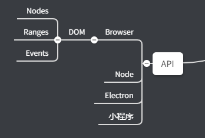
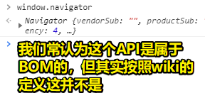
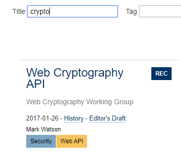
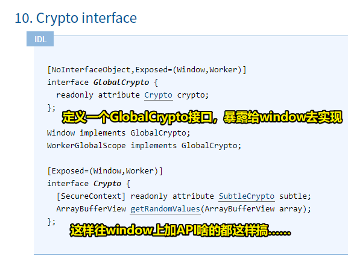
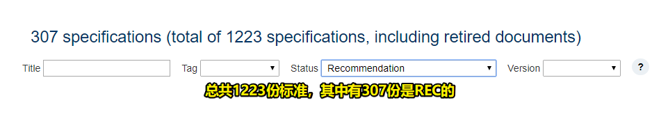
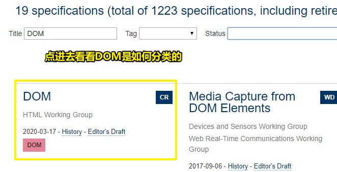
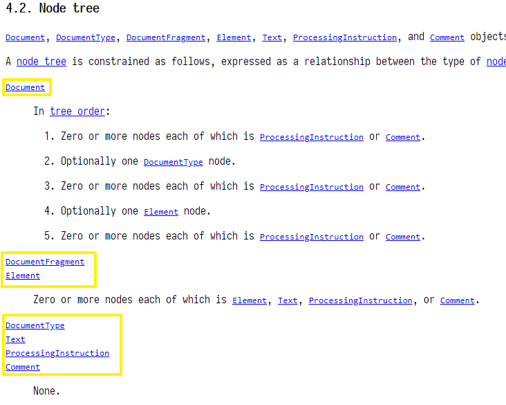
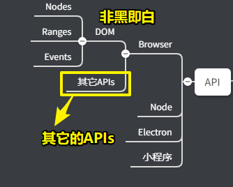

# 03-整理 API

## ★产出

## ★解释

### <mark>1）如何整理API</mark>

由于偏前端，所以只讲 Browser，像 Node、小程序等已经不算完全的前端了，它们已经是全新的领域了……

我们最熟悉的 Browser API 是 DOM、BOM

话说，DOM 和BOM是并列关系还是包含关系？

BOM到底是从哪儿来的？ -> 特别适合用追溯法

wiki提供了这样一些线索：「没有实现的标准，也没有严格的定义，浏览器供应商可以自由地以任何它们所希望的方式实现 BOM」

➹：[Browser Object Model - Wikipedia](https://en.wikipedia.org/wiki/Browser_Object_Model)

我们常常认为属于BOM的东西：

为啥这样说呢？

因为whatwg直接把这个API写进标准里边了：[HTML Standard](https://html.spec.whatwg.org/multipage/system-state.html)

既然已经在标准里了，按照wiki的定义，这已经不属于BOM了

BOM API 在HTML里边其实非常少的，如「crypto」 -> `window.crypto` -> 定义在一个独立的 Web API里边：

➹：[Web Cryptography API](https://www.w3.org/TR/2017/REC-WebCryptoAPI-20170126/)

> 把crypto暴露到window和worker上 -> 相当于让window和worker去实现这个crypto interface -> 结果：window、worker旗下多了一个crypto API -> 为window加API、属性啥的都这样干……

标准总数：

这1223份标准包含了很多对window扩展的API，而这都属于web platform API

而这就是为啥谷歌那几个公司搞了个这样的网站：

➹：[APIs · WebPlatform Docs](https://webplatform.github.io/docs/apis/#List-of-all-APIs)

这个网站里边所描述的API既不属于BOM和DOM，由于没有合适的名字，所以就叫做 webplatform 了

可以参考这个写我们的API列表，也可以到w3c标准里边去找

### <mark>2）DOM</mark>

> DOM defines a platform-neutral model for events, aborting activities, and node trees.

DOM到底包含什么？

找到一份标准：

根据目录，它主要包含了四块东西：

- Nodes
- Ranges -> 一个非常实用的API
- Events

> Traversal -> 是一个垃圾API，现在学习它没有任何意义 -> 古老环境下出现，没有任何实际意义 -> 与JS那个iterator三观不合，所以这玩意儿没有任何价值，还不如用next等这几个属性去搞呢！没有人会用Traversal这东西去遍历整个DOM树

所以学DOM主要学这3部分就ok了！

#### 1、Nodes

跟HTML所有的节点有一一对应的关系 -> HTML有什么节点，那么Nodes就有什么样的interface -> 一种一一对应的关系

有这么几种根的基类，即一个Nodes主要分成这么几种类型：

- Document -> 文档本身
- DocumentFragment -> 永远不会挂到树上
- Element -> 元素
- DocumentType -> DTD
- Text -> 文本
- ProcessingInstruction -> 问号标签，也是有一个书写规范的 -> 大概这么写`<?key value?>`，跟注释差不多，但赋予了一定的语义，不过，没有规定要怎么写
- Comment -> 注释 -> `<!-- sdada -->`

以上这部分DOM API，其实跟HTML的语法是完全一一对应的

规定DOM的范围就是那三部分内容，剩下的五花八门，可以在「DOM」同级下在另起一个节点：

> 如果有兴趣，那就做一个爬虫去爬一下w3c这些标准里边，哪些对window对象进行了扩展 -> 任务难搞，但收获应该不少

## ★More

### <mark>1）DOM和BOM有关系吗？</mark>

- DOM看document
- BOM看window

➹：[What is the DOM and BOM in JavaScript? - Stack Overflow](https://stackoverflow.com/questions/4416317/what-is-the-dom-and-bom-in-javascript)

➹：[BOM(Browser Object Model) - 简书](https://www.jianshu.com/p/53fe948958bb)

### <mark>2）crypto是什么东西？</mark>

➹：[crypto是什么：加密货币与加密技术 - 知乎](https://zhuanlan.zhihu.com/p/44320247)

➹：[一行代码生成随机字符串 - 知乎](https://zhuanlan.zhihu.com/p/39664122)

➹：[加解密与前端应用 - 知乎](https://zhuanlan.zhihu.com/p/138306734)

