# 02-重学-构建知识体系

## 1、这节课讲什么？

- 实践 -> 如何建立知识体系
- 把上节课的预习作业给写了 -> 为啥要写上节课的预习作业？ -> 预习作业的目的：先让大家在这上边有一定的**探索和思考** -> 对比winter在课上完成的脑图，思考为啥会有差别……
- 这节课会产出一份脑图 -> 之后的每节课都会以这种**产出明确东西**的方式来学习，除此之外，尽量减少课后作业，能在课堂上完成的尽量在课堂上完成，如课上写代码，总结等各种各样的任务 -> 纯用手机看等于课程白上，推荐在电脑端上看，跟着winter一起**互动**…… -> 目前课程的安排和强度，winter认为课后还得要做一些工作

## 2、课前准备？

**1）下载ECMAScript，即JS标准**

[Welcome to Ecma International](https://www.ecma-international.org/default.htm) -> 点一下「standards」这个nav -> 选择「ECMA-262」这个标准：

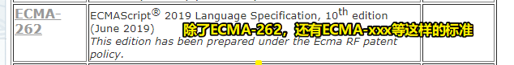

> [Standard ECMA-262](https://www.ecma-international.org/publications/standards/Ecma-262.htm)

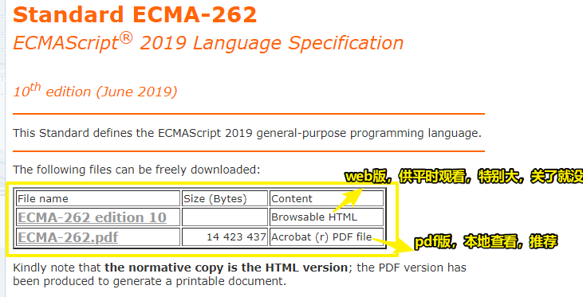

> pdf版 -> 方便随时查阅，毕竟winter这次训练营会经常查阅这个ECMA-262标准

小知识：

> ecma-international.org -> I18N 是 InternationalizatioN (国际化) 的缩写，第一个字 `I` 与最後一个字 `N` 之间有 `18` 个字母

恭喜玩家获得一个「标准在哪儿」的知识


除此之外，它还有个github版的 -> 是该标准最新的draft，特点「很新」：

[ECMAScript® 2021 Language Specification](https://tc39.es/ecma262/)

目前最稳定的版本是5.1版和3.0版的，由于3.0版太老了，推荐使用5.1版的

10版的和5.1版的页数比较：**764页 vs 258页**

如果对新特性没有特别的追求，那么推荐大家先看**5.1版**的，毕竟最新版的内容贼鸡儿多，容易在里边迷失掉

**2）除了看标准以外，还推荐几个比较值得信赖的网站**

- [Web technology for developers - MDN](https://developer.mozilla.org/en-US/docs/Web)
- [Web Hypertext Application Technology Working Group (WHATWG)](https://whatwg.org/)
- [All Standards and Drafts - W3C](https://www.w3.org/TR/)

## 3、标准、文档都是英文的？

你会发现，现在**好一点的资料基本上都是英文的**，所以「你不想看英文」是没有办法可以解决的，不过，好消息的是，你能否看得懂这些标准、文档，跟你的英文水平不是特别的有关系

为啥这样说呢？

你把这些标准给到一个英文水平很好的人，你会发现ta也看不懂

总之，不要有啥心理压力的，看多了自然就懂了，不存在外语好坏之分（不要因英文水平低就自卑），只存在你在这上面**花了多少时间**

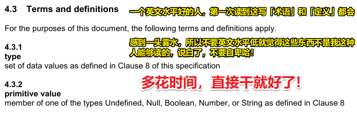

> 这「写」 -> 这「些」

## 4、画脑图？

工具 -> xmind -> 不会用到很多很深入的功能，随便用用即可

如果你不用软件，当然，也可以用白板、本子等 -> 手画

如果以上都没有，那么可以打开你的VSCode，新建一个文件，用缩进来代替脑图 -> 想象力比较好用这种形式也是没有问题的

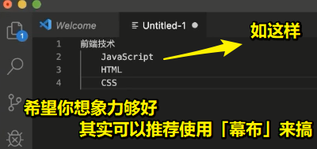

> 不是说你非得要用啥工具，而是你的思维要体现在这图上

第0期的脑图：没有 -> 得找老师要……

> 理想状态下，我们产出的脑图与winter产出的有细微的差别

第1期脑图要点：

### <mark>1）树根：「前端技术」</mark>

### <mark>2）树干：</mark>

- JS它本身只包含语言，不包含API
- API -> 大块分 -> 包含几个不同的环境（属于一个特定的开发环境，体系独立，不管是谁来定义和设计的，这都是属于完全互相割裂的开发生态） -> 前端不需要掌握所有
  - 最典型的Browser环境
  - Node
  - Electron
  - 小程序

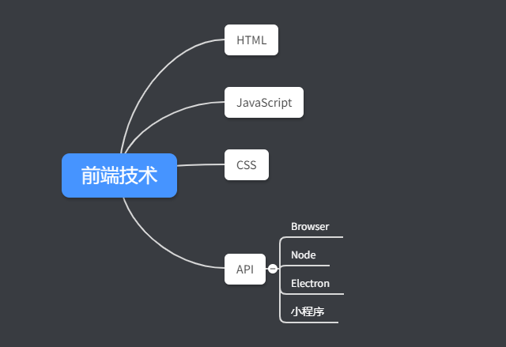


### <mark>3）HTML：</mark>

HTML的划分用分维度的姿势来划分，如语言维度，HTML肯定是个语言，但是我们直觉上看，它跟JS这样语言有本质上的（再次强调，本质上的意思就是说词的定义）区别 -> 我们不叫HTML为编程语言，而是计算机语言

- HTML从语言的角度来看，它继承了三方面的内容
  - 通用计算机语言
    - 编译原理 -> 有语法和词法 -> 这俩点很关键
  - [SGML](https://en.wikipedia.org/wiki/Standard_Generalized_Markup_Language#History) ->  起源于 IBM 在1960s 诞生的 GML （通用标记语言） -> 不需要学它 -> 研究一下SGML给HTML带来了什么样的特点 -> 对HTML的影响有：
    - DTD
    - Entity
  - XML -> 对HTML的影响有：
    - Namespace
    - Tag

> 直接就是从语言角度来看了

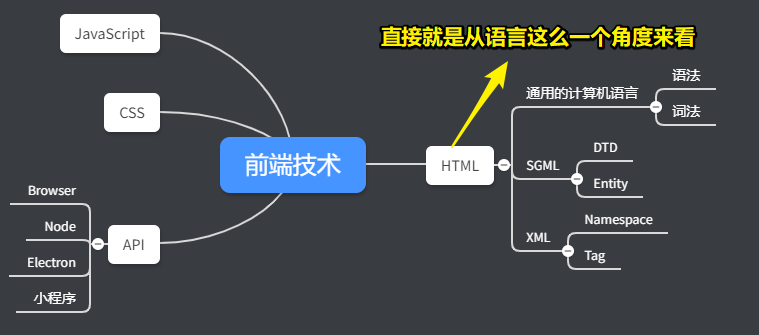

**语法 & 词法：**

在哪儿看HTML的语法？

> [HTML Standard](https://html.spec.whatwg.org/multipage/#toc-syntax)

这资料特别的神奇，不仅仅是讲语言语法，还把实现都给讲了，不过，这是让人很难受的，正常来说，应该还有一份词法定义

HTML的词法分析 -> Tokenization是做词法分析的这么一个过程 -> 像是伪代码

有多少种词？ -> 搜索 `Emit `（有个空格） -> 找到token类型

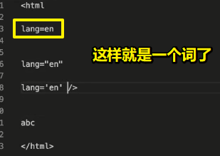

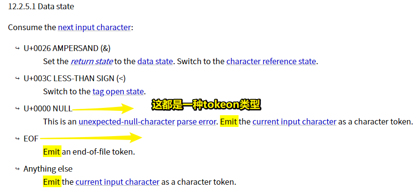

了解以上知识的目的：**知道语法和词法到底是个什么东西**

如果不学它们，就会在HTML里边产生一些问题

如人家问你：HTML 的中，如何写一个值为 `“a”=‘b’` 的属性值？

学语法的目的 -> **知道这个东西要怎么写，这东西必然会有一个写法的**

得到了零碎碎的词后，接下来看看HTML的语法

不过它没有一份正常的语法定义 -> 了解它的语法「Tree construction」（不叫「Grammar」or「Syntax」）

主要讲了：**当你在啥位置，遇到什么token，就会有啥反应**

> 支持了很多历史版本的DTD

以上就是有关HTML的语法和词法了

**任何一门语言，它一定会有继承自「通用计算机语言」的这种属性，如语法和词法**

> 学习任何一门的语言，都要去看看它的语法和词法，如英语 -> 语法+单词，古老的语言「 [COCOA](https://en.wikipedia.org/wiki/COCOA_(digital_humanities))」 ->  COCOA 标签是扁平的，而不是树形结构……等

**SGML：**

HTML主要从SGML里边继承了DTD（Document Type Definition or Document Type Declaration）

HTML5的DTD长这样（非常简单）：

``` html
<!DOCTYPE html>
```

不过这已经不符合SGML规范了，毕竟HTML不是一份完全的SGML的文档，它继承了SGML的特性，在HTML的早期版本里边，这一点会更明显一点，但即便再早期，它也不是SGML的文档

搜索「html 4.0 dtd site:www.w3.org」

[W3C QA - Recommended list of Doctype declarations you can use in your Web document](https://www.w3.org/QA/2002/04/valid-dtd-list.html)

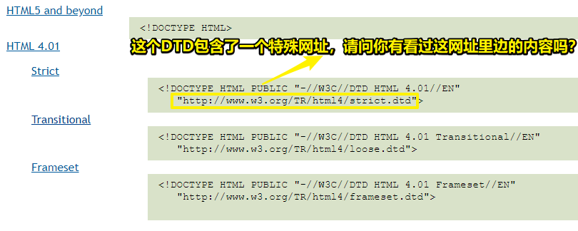

如果你好奇打开过这个[网址](http://www.w3.org/TR/html4/strict.dtd)，它开后，你会看到这其实是一份SGML规范的dtd -> 定义里整个HTML里边允许出现哪些属性、有哪些标签、有哪些Entity（`&`） -> 不需要投入很大精力去看这里边的内容，因为这已经成为了历史，HTML5已经抛弃了这种形式的DTD了

当然，这里边有一个非常重要的部分，那就是「实体定义」，搜索「Character mnemonic entities」（**这东西是告诉你有多少种别名的**）：

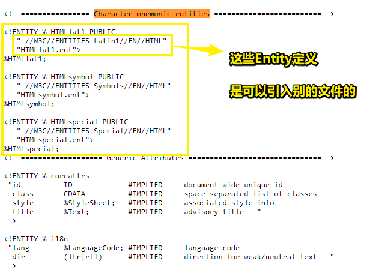

> DTD（Document……） -> ETD（Entity……）

我们日常看到的`&nbsp;`、`&lt;`、`&quot;`……等，都是定义在别的文件里边的，而我们可以下载这些文件：

- <https://www.w3.org/TR/html4/HTMLlat1.ent>
- <https://www.w3.org/TR/html4/HTMLsymbol.ent>
- <https://www.w3.org/TR/html4/HTMLspecial.ent>

打开这些文件，你会看到：

``` html

<!-- HTMLlat1; -->

<!ENTITY nbsp   CDATA "&#160;" -- no-break space = non-breaking space,
                                  U+00A0 ISOnum -->
<!ENTITY iexcl  CDATA "&#161;" -- inverted exclamation mark, U+00A1 ISOnum -->
<!ENTITY cent   CDATA "&#162;" -- cent sign, U+00A2 ISOnum -->

<!-- ----------------- -->

<!-- HTMLsymbol; -->

<!-- Latin Extended-B -->
<!ENTITY fnof     CDATA "&#402;" -- latin small f with hook = function
                                    = florin, U+0192 ISOtech -->

<!-- Greek -->
<!ENTITY Alpha    CDATA "&#913;" -- greek capital letter alpha, U+0391 -->
<!ENTITY Beta     CDATA "&#914;" -- greek capital letter beta, U+0392 -->

<!-- ----------------- -->

<!-- HTMLspecial; -->

<!-- C0 Controls and Basic Latin -->
<!ENTITY quot    CDATA "&#34;"   -- quotation mark = APL quote,
                                    U+0022 ISOnum -->
<!ENTITY amp     CDATA "&#38;"   -- ampersand, U+0026 ISOnum -->
<!ENTITY lt      CDATA "&#60;"   -- less-than sign, U+003C ISOnum -->
<!ENTITY gt      CDATA "&#62;"   -- greater-than sign, U+003E ISOnum -->
```

HTML 中有用的字符实体（实体名称对大小写敏感）：

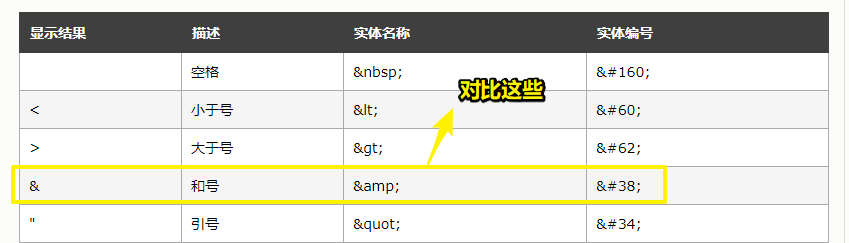

为啥winter要让我们去看这些内容呢？

因为Entity这玩意儿只能在这些文件（**.ent**）里边找到严格的定义，如果你想找Entity完整列表，或者实现一个类似浏览器这样的东西，那么你就只能从「Character mnemonic entities」这部分来看来搞了 -> 它一共包含了3个文件，这些文件都包含了很奇怪的、我们没有见过的的字符实体 -> 如果你想玩一点有意思的东西，写一些大家看不懂的代码，就可以在里边挑选一些奇葩的字符实体搞一下，用于成为一种谈资，不过需要注意的是「工作中少用」，当然，玩的时候就随便你玩……

> 作业：把实体的名字都写到「Entity」里边去

话说，为啥要了解这个呢？

其实在项目里边，**有很多东西并不一定有用**，但是你一定要知道这个东西的**来龙去脉**，像winter对于这些实体列表的记忆，只记得`&`的`&amp;`、空格的`&nbsp;`、小于号的`&lt;`、大于号的`&gt;`等这么几个常用的字符实体，而至于其它你记不住的，你一定要知道**这些玩意儿在哪儿去找**，千万不要说「我不知道去哪儿学这些玩意儿」 -> **「你知道这玩意儿是个什么样的东西」这件事，远远要比你记住这个知识本身更重要**（这句话会一直在课程里边体现，目前我确实不理解这话在表达啥意思，是告诉我要知道这东西的来龙去脉吗？而不是仅仅记住一个死知识吗？如我空格就是`&nbsp;`，那xx字符呢？额……我不知道，但我知道自己应该到哪儿去学习这东西）……

总之，补全Entity列表 -> 对我们来说是一个非常有意义的这么一件事

说完了继承自SGML的部分，接下来就说说继承自XML的部分

> Entity：这个单词不好翻译，一般我们就说它是「实体」之意，**在HTML这个语境下**，Entity就是`&`符后边的东西，即那个名字玩意儿——如`nbsp`

---

**XML：**

HTML继承自XML的部分，相对我们大家来说，是真正比较实用的部分

**①Namespace：**

大家知道HTML里边允许出现的Namespace有几个吗？

1. SVG
2. MathML
3. ARIA

ARIA：

> 在whatwg的HTML标准里边没有出现过这个东西，虽然没有提到，但它反而是一个特别重要的东西，尤其是在国外，你不搞aria这东西的话，整个公司可能会被告 -> 全称「Accessible Rich Internet Applications 」
> 
> 它大概的长相？（举个栗子） -> 给HTML扩展了一个role属性，用于标识一个元素的作用，然后你就可以对该元素加一些`aria-`相关的特性，如你用div元素拼了一个输入框、下拉选择框之类的，如果你想要让盲人的这种软件知道这是一个下拉选择框的话，那么我们就得加个role，这样盲人的读屏软件就可以识别出来了，像 `nav`已经隐含ARIA的`role="navigation"`声明，就不用在`nav`标签上在定义`role`或者`aria`就能被读屏软件识别。而没有语义化的元素如`<div class="navigation">`则推荐使用 `role="navigation"` -> 目前不需要深入理解这玩意儿

> winter主要告诉我们与namespace相关的主要有这么三个东西

HTML默认的主namespace，是省略掉的：[HTML html xmlns Attribute](https://www.w3schools.com/tags/att_html_xmlns.asp)

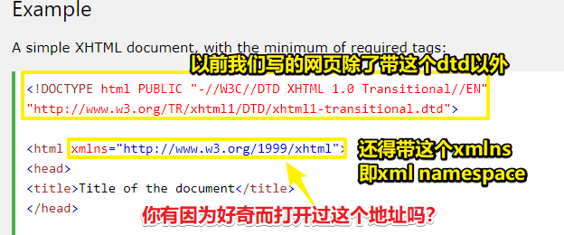

「<http://www.w3.org/1999/xhtml>」这个玩意儿也是可以打开的（打开得比较慢，不要怀疑这网址已经GG了） -> W3C有个指导原则，它要求所有的浏览器实现这个网页浏览的时候，绝对不能够在打开网页的时候，访问这两个网址——图中的`.dtd`和xmlns的值

为啥要这样呢？ -> 因为之前真得有愚蠢的浏览器做过这样的事儿，即打开网页就访问这两个网址，类似于我们img标签的src属性这样…… -> 这样一来就把w3c的服务器给打挂了，毕竟这样的浏览器每次访问一个网页都得「捉弄」一下w3c的服务器……

> 该网址里边的内容本来是XML对这个文档格式的这么一个定义

站在XML的角度来看HTML，你会知道HTML它为啥会有xmlns

XML与SGML的DTD从不同的格式定义了HTML这个东西，当然，你可以看到，HTML既不是标准的SGML，也不是标准的XML

> HTML除了有「语言的自我修养」以外，还抄了来自SGML与XML里边的一些姿势

HTML -> 有特殊的行为 -> 有这样一些特殊的规则：允许你瞎胡乱写，而且还能给你解析对……

**如果你想要了解一门语言，如HTML，那么你必须得从它的这个各个历史继承关系这儿把它给讲出来**

**②Tag：**

HTML其实最主要的一部分特性就是「Tag」了 -> 对Tag详细展开「铺开、大规模地进行（某种活动）」来讲

从哪里找这个「Tag」？

1. MDN -> 一个不错的选择：[HTML: Hypertext Markup Language - MDN](https://developer.mozilla.org/en-US/docs/Web/HTML)
2. whatwg标准 -> 第四章The elements of HTML -> 可以看到该标准是如何对HTML元素进行分类的

有多少个HTML元素？

打开这个[页面](https://html.spec.whatwg.org/multipage/#toc-semantics)，在控制台把以下代码给输入进去：

``` js
function unique (arr) {
  return Array.from(new Set(arr))
}

const toc4 =  document.getElementById('toc-semantics')

let eleArray = unique(Array.prototype.map.call(toc4.querySelectorAll('code'), e => {
  if(e.parentNode.lastChild.data == ' element' || e.parentNode.lastChild.data == ' elements') {
      return e.innerText
    } else {
      return ''
    }
}))

// 113 -> 113-1=112（减去一个多余的空格）
let eleNum = eleArray.length - 1
console.log('元素个数 ->',eleNum)
console.log(eleArray.join(' ~ '))
```

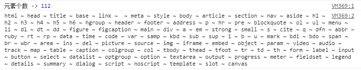

校验是否正确 -> 是否和whatwg这个目录给出的元素个数一致？

拿到这个元素列表，就根据目录整理一下，在整理的过程中会对这些东西有一个更深入的理解

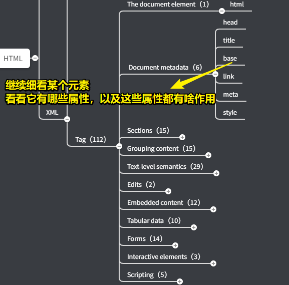

整理完Tag之后 -> 下一步 -> 细看每个标签 -> 看看这些标签都有哪些属性 -> 继续往里看 -> 看看这些属性又有哪些作用以及怎么用它们（何时用） -> 如 [canvas](https://html.spec.whatwg.org/multipage/canvas.html#the-canvas-element) 这个元素就贼鸡儿复杂

> 想想用Vue写组件 -> Tag、属性（有哪些属性，以及都有啥作用） -> 样式、交互 -> 把组件看成是一个函数，即标签名就是一个函数名，属性就是形参，属性值就是实参

至此，有关对HTML的总结与整理基本就到这儿了……

---

### <mark>4）小结</mark>

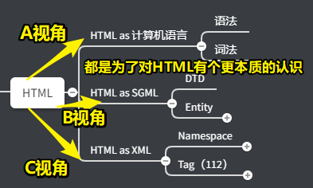

我们去看HTML，其实是带着**三个角度**去看的 -> 看了三遍HTML

- 第一次，把HTML作为计算机语言来看待，这个时候就得去看它的语法和词法
- 第二次，作为SGML来看，这个时候就关心它的DTD和Entity，以及这个实体定义的一切的东西
- 第三次，作为XML来看，关心它有哪些Tag、有哪些Namespace -> SVG这个Namespace里边还有一堆元素，MathML也是如此，而ARIA里边则没有元素，但是它定义了一堆属性

总之，以上就是我们去看待HTML的一个视角，同时这也是上节课里提到的整理法的实际应用 -> 用一种**维度关系**去分析HTML

接下来就来看看JavaScript……

---

### <mark>5）More</mark>

线索：「语法 词法」

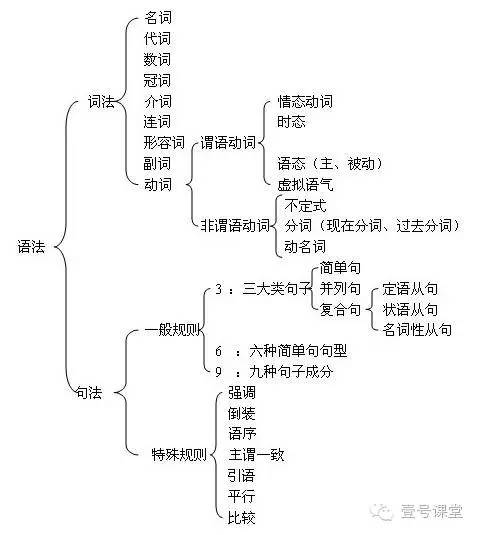

➹：[NLP中的文法，词法，语法，句法怎么理解？有什么区别和不同？ - 知乎](https://www.zhihu.com/question/22387748)

➹：[★词法、语法与语义相关知识 - lightsong - 博客园](https://www.cnblogs.com/lightsong/p/6107310.html)

✌：「DTD」

> DTD的全称是Document Type Defination，即文档类型定义。通过定义DTD，使浏览器使用相应的**渲染模式**（`document.compatMode`）对页面进行解析渲染。

> HTML4.01基于SGML -> 所以需要引用DTD -> 而DTD 规定了标记语言的规则，这样浏览器才能正确地呈现内容 -> 有三种姿势的DTD -> strict.dtd、loose.dtd、frameset.dtd
> 
> HTML5不基于 SGML -> 所以不需要引用 DTD -> 直接`<!DOCTYPE HTML>` -> 浏览器看到这个就会开始开启**标准模式**（CSS1Compat -> W3C的标准）解析渲染页面 -> 如果不写`<!DOCTYPE HTML>` -> 那么浏览器会使用自己的怪异模式（BackCompat）解析渲染页面 -> 不同的浏览器都使用自己的默认渲染模式，显示出来的页面样式也会不同 -> 而这也就是为啥要写`<!DOCTYPE HTML>`的原因所在了
> 
> `<!DOCTYPE HTML>` -> 如果是HTML文档 -> 写在第一行（html元素的前边） -> 大小写不敏感 -> 没有结束标签，也咩有自闭合

➹：[HTML--DTD - 知乎](https://zhuanlan.zhihu.com/p/86079104)

➹：[DTD（Document Type Definition）：文档类型定义 - 知乎](https://zhuanlan.zhihu.com/p/67708489)

➹：[★HTML5发展简史 - 知乎](https://zhuanlan.zhihu.com/p/44164232)

➹：[★简单聊一下DOCTYPE - 知乎](https://zhuanlan.zhihu.com/p/32460261)

➹：[xsd，dtd，tld有什么区别和联系？ - 知乎](https://www.zhihu.com/question/38843167)

➹：[学习笔记，DTD - 知乎](https://zhuanlan.zhihu.com/p/38441148)

➹：[HTML5的22小技巧 - 知乎](https://zhuanlan.zhihu.com/p/66589116)

✌：「namespace」

> 命名空间 -> 是对作用域的一种特殊的抽象 -> 标识符 -> 模块化
> 
> 如张三在公司 A，他的工号是 111，李四在公司 B，他的工号也是 111，因为两个人在不同的公司，他们俩的工号可以相同但是不会引起混乱，这里的公司就表示一个独立的命名空间，如果两个人在一个公司的话，他们的工号就不能相同，否则光看工号也不知道到底是谁。
> 

命名空间下，可以使用一些特殊的标签，如svg标签有个「`xmlns="http://www.w3.org/2000/svg"`」属性，那么svg标签里边所嵌套的元素就可以有这样的元素`circle`……而如果你把这个`circle`元素从svg里边脱离开来写在与svg元素同级的位置，那么这元素浏览器是不认识的…… -> 进一步联想到我们用vue写的自定义组件，其实也可以把Vue看做是一种特殊的「命名空间」……即Vue是一个定义规则的家伙，我们遵守规则，才能写出像样的自定义组件

➹：[html xmlns=http://www.w3.org/1999/xhtm的解释_网络_ 燃的博客-CSDN博客](https://blog.csdn.net/qq_26440903/article/details/52592501)

➹：[xml - What is the default namespace for HTML / HTML5? - Stack Overflow](https://stackoverflow.com/questions/34407468/what-is-the-default-namespace-for-html-html5)

➹：[最近传的文章「HTML6 展望」中的命名空间有什么意义？ - 知乎](https://www.zhihu.com/question/26991289)

➹：[命名空间 - 知乎](https://www.zhihu.com/topic/19966392/hot)

➹：[XML命名空间读写操作的实例？ - 安静的木小昊的回答 - 知乎](https://www.zhihu.com/question/40912682/answer/498144750)

➹：[你真的知道什么是 “命名空间” 吗？ - 知乎](https://zhuanlan.zhihu.com/p/42399724)

✌：「MathML」

> Mathematical Markup Language (MathML) 是一个用于**描述数学公式、符号**的一种 XML 标记语言。

➹：[MathML - MDN](https://developer.mozilla.org/zh-CN/docs/Web/MathML)

➹：[数学标记语言 - 维基百科，自由的百科全书](https://zh.wikipedia.org/wiki/%E6%95%B0%E5%AD%A6%E7%BD%AE%E6%A0%87%E8%AF%AD%E8%A8%80)

✌：「SVG」

> 可缩放矢量图形（英语：Scalable Vector Graphics，SVG）是一种基于可扩展标记语言（XML），用于**描述二维矢量图形的图形格式**。SVG由W3C制定，是一个开放标准。

➹：[Scalable Vector Graphics - Wikipedia](https://en.wikipedia.org/wiki/Scalable_Vector_Graphics)

➹：[SVG 图像入门教程 - 阮一峰的网络日志](https://www.ruanyifeng.com/blog/2018/08/svg.html)

✌：「html ARIA」

> WAI-ARIA，简称 ARIA

➹：[网站无障碍化简介 - 知乎](https://zhuanlan.zhihu.com/p/97699978)

➹：[如何理解Web语义化 - 知乎](https://zhuanlan.zhihu.com/p/25493886)

➹：[aria-labelledby 的用法是怎样的？ - 知乎](https://www.zhihu.com/question/36769003)

➹：[如何使用 ARIA 属性正确标注自定义下拉选择组件？ - 知乎](https://www.zhihu.com/question/322959031)

➹：[WAI-ARIA basics - 学习 Web 开发 - MDN](https://developer.mozilla.org/zh-CN/docs/learn/Accessibility/WAI-ARIA_basics)

➹：[ARIA 简介  -  Web  -  Google Developers](https://developers.google.com/web/fundamentals/accessibility/semantics-aria?hl=zh-cn)

➹：[ARIA in HTML](https://www.w3.org/TR/html-aria/)

✌：「HTML元素个数」

➹：[HTML5标准中有多少个标签元素，都怎么用 - 拍岸的博客 - Paian's Blog](https://mobilesite.github.io/2015/09/02/use-of-all-html5-elements/)

➹：[HTML 到底有多少标签(HTML tag)？ - 知乎](https://zhuanlan.zhihu.com/p/81132589)


