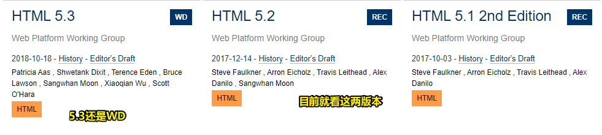

## ★More

1）在w3c标准里边，像REC这样的东西到底表示的是什么？

➹：[W3C标准流程与组织架构 - 知乎](https://zhuanlan.zhihu.com/p/36103933)

2）色域标准？

为啥会有那么多色域标准？

人眼可见的色彩包含数百万种颜色，但扫描仪、显示器和彩色打印机等显色设备只能产生（重现）其中的一部分颜色（色彩子集），这个"子集"称为色域。因此，人们为不同的领域制定了不同的色域标准。

> 人看到的颜色种数 vs 显色设备能显示的颜色种数 -> 前者是爸爸，后者是弟弟……

有哪些色域标准？

sRGB -> 这种标准得到了W3C的支持 -> 用于互联网

> 色域并不一定是谁比谁更好，它们都有其特定的专精用途。近年来，随着广色域的普及，我们可以期待显色设备给我们带来更出色的色彩表现。

➹：[浅谈几种常见的色域标准 - 知乎](https://zhuanlan.zhihu.com/p/45533004)

3）HTML5已经退休了？

目前看的HTML版本：

➹：[[译]HTML 5.2新特性 - 知乎](https://zhuanlan.zhihu.com/p/33174266)

4）我们可以去阅读的CSS版本？

> 语法写的标准

➹：[Grammar of CSS 2.1](https://www.w3.org/TR/2011/REC-CSS2-20110607/grammar.html#grammar)

